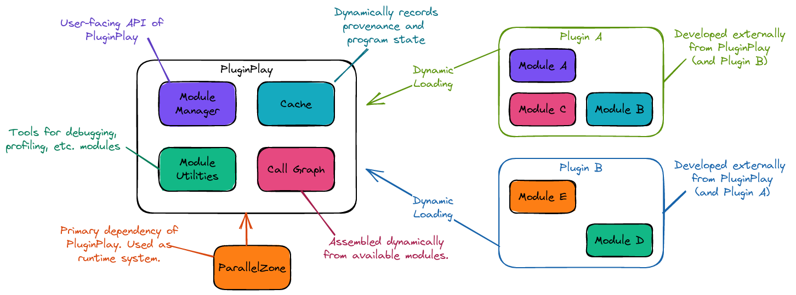

.. Copyright 2022 NWChemEx-Project
..
.. Licensed under the Apache License, Version 2.0 (the "License");
.. you may not use this file except in compliance with the License.
.. You may obtain a copy of the License at
..
.. http://www.apache.org/licenses/LICENSE-2.0
..
.. Unless required by applicable law or agreed to in writing, software
.. distributed under the License is distributed on an "AS IS" BASIS,
.. WITHOUT WARRANTIES OR CONDITIONS OF ANY KIND, either express or implied.
.. See the License for the specific language governing permissions and
.. limitations under the License.

.. _pp_architecture:

##########################
Architecture of PluginPlay
##########################

This page describes the overarching architecture of PluginPlay and focuses
on how this architecture addresses the considerations raised in the
:ref:`pp_statement_of_need` section.

.. _fig_pp_arch_full:

   Architecture of PluginPlay. The left side shows the contents of PluginPlay
   (including its major dependency). The right shows how PluginPlay is fed
   contents, *i.e.*, by ingesting plugins containing modules.

Fig. :ref:`fig_pp_arch_full` shows the conceptual architecture of PluginPlay.
PluginPlay itself is built on top of the runtime system implemented by
`ParallelZone <https://github.com/NWChemEx-Project/ParallelZone>`__.
Internally PluginPlay is made up of four components:

1. **Module Manager**. Which is the user-facing :ref:`api` for the PluginPlay
   framework. Loading modules, manipulating the call graph, and inspecting
   module state all goes through the module manager.
#. **Cache**. When a module runs the inputs/results to/from the module are
   recorded in the cache.
#. **Module Utilities**. A collection of module development tools spanning
   debugging, profiling, documenting, and much more.
#. **Call Graph**. This component contains a runtime representation of the
   program's control flow.

Fig. :ref:`fig_pp_arch_full` also tries to make the point that PluginPlay is
just a framework, *i.e.*, a piece of software designed to facilitate writing
other software by serving as a "template" for the program. PluginPlay does not
contain any scientific functionality; scientific functionality must be supplied
by plugins (and the modules in them). If it helps, you can think of PluginPlay
as a meta-package meant to facilitate working with other packages.

The following subsections summarize the PluginPlay components in more detail.

************
ParallelZone
************

ParallelZone is a runtime system, *i.e.*, a library meant to provide a software
abstraction between the hardware/operating system and a program. In particular,
ParallelZone provides abstractions for:

- Determining what hardware, and how much, the software is currently running on.
- Message-based distributed parallelism.
- Logging.
- Task-based scheduling.

PluginPlay uses ParallelZone to make informed cache decisions (*vide infra*),
schedule modules, record progress, and much more.

The NWChemEx-Project organization develops ParallelZone as a separate project,
in the hope that it will prove useful for other libraries/frameworks besides
PluginPlay. More details pertaining to the design of ParallelZone can be found
`here <https://nwchemex-project.github.io/ParallelZone/developer/design/parallel_zone.html>`__.

**************
Module Manager
**************

Implemented by the ``ModuleManager`` class, the module manager component is
responsible for most runtime interactions between the user and ParallelZone.
These interactions include:

- Loading modules into PluginPlay
- Querying the available modules
- Changing how the call graph is wired
- Saving/loading call graph execution progress

The design of the module manager component is discussed in more detail in the
:ref:`module_manager_design` section.

*****
Cache
*****

.. note::

   Although we are somewhat "putting the cart before the horse" by introducing
   the cache component here, the cache is an important design point of
   PluginPlay and has serious performance considerations. Hence we feel it
   is worth considering the cache in the top-level architecture.

While perhaps not clear at this point, one downside to encapsulation is that it
makes it difficult to discern exactly what intermediates a :ref:`module` may
have computed since :ref:`module` objects are largely opaque. If recomputing
the intermediates is expensive, then it is essential that the recomputation
be avoided. PluginPlay's solution is to rely on :ref:`memoization`.

In short, PluginPlay saves the inputs/results provided to/by the :ref:`module`
in the cache. Then if the same inputs are again provided to the same module,
PluginPlay automatically returns the cached results. In practice,
:ref:`memoization` can also be used as a save/load (or sometimes called
checkpoint/restart) mechanism, *i.e.*, start with a cache from a previous run,
rerun the program, and allow control to reach parity with the previous run
(which because of :ref:`memoization` should happen quickly).

More design details pertaining to :ref:`memoization` can be found in the
:ref:`memoization_design` section and more details about the design of the
cache can be found in the :ref:`cache_design` section.

**********
Call Graph
**********

Most user interactions with PluginPlay pertain to modifying the state of the
call graph. This includes:

- changing what modules can be in the call graph,
- modifying how the modules are wired together, and
- setting the values of :ref:`bound_input`.

Users actually do the above through a ``ModuleManager`` object, but under the
hood the ``ModuleManager`` is interacting with the call graph component of
PluginPlay. More detailed design documentation can be found in
:ref:`call_graph_design`.

*******
Summary
*******

This design specifically addresses the considerations raised in the
:ref:`pp_statement_of_need` section by:

1. Performance

   - PluginPlay is built on ParallelZone, which is a performance-centric
     runtime system.
   - Cache feature enables memoization to avoid redundant module runs
   - Module utilities help with performance tuning
   - Dynamically swapping out modules can enable using hardware-specific
     versions
   - Plugins make it easy to add hardware-specific modules after the fact

#. Modular/Component-Based Architecture

   - Program's call graph assembled by wiring modules together.
   - Plugins allow distributing related modules together.
   - Module manager allows interacting with the modules.

#. Dynamic Module Interfaces

   - Dynamically changes how modules in the call graph communicate
   - Falls under the call graph component
