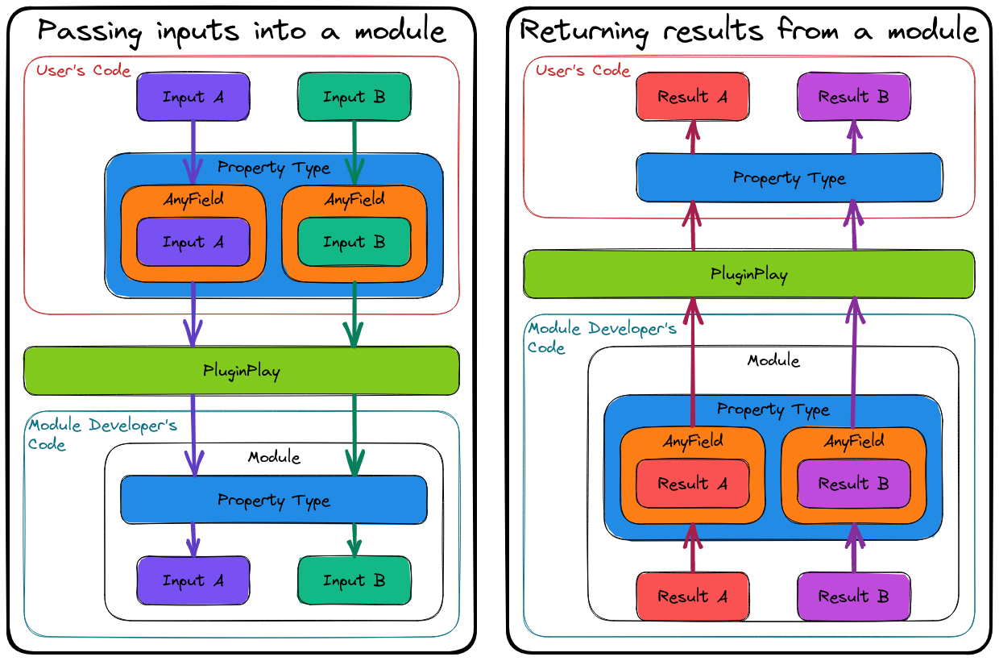
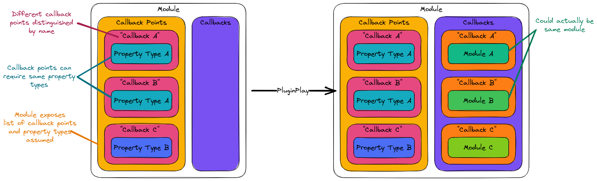

.. Copyright 2022 NWChemEx-Project
..
.. Licensed under the Apache License, Version 2.0 (the "License");
.. you may not use this file except in compliance with the License.
.. You may obtain a copy of the License at
..
.. http://www.apache.org/licenses/LICENSE-2.0
..
.. Unless required by applicable law or agreed to in writing, software
.. distributed under the License is distributed on an "AS IS" BASIS,
.. WITHOUT WARRANTIES OR CONDITIONS OF ANY KIND, either express or implied.
.. See the License for the specific language governing permissions and
.. limitations under the License.

.. _call_graph_design:

##################################
Designing the Call Graph Component
##################################

Stemming from the discussions in :ref:`pp_architecture` and
:ref:`module_manager_design` PluginPlay needs a call graph component. This
section describes the overall design of that component.

*********************
What is a call graph?
*********************

.. note::

   To make contact with typical computer science terminology the use of static
   and dynamic call graphs differ somewhat in this section than in other places
   of the manual.

Call graphs are graphs (in the mathematical sense) that represent the control
flow of a program. Each node in a call graph represents one function in the
program. Edges between nodes are directed from the calling function to the
called function. Given the complexity of most programs, call graph
representations are typically determined by running the program and recording
the control flow. The resulting call graph is only representative
of the run used to generate it. Such call graphs are typically known as
"dynamic" call graphs, since they are generated dynamically. In theory, there
also exists a "static" call graph which shows all possible control flow paths
through the program; however, for most programs this call graph is far too
complicated to be useful and determining it has undecidable complexity.

In the PluginPlay call graph component we define "call graph" slightly
differently than the computer science definition just given. In particular, in
PluginPlay's call graph component, the nodes are user-provided :ref:`module`
objects, not individual function calls. Similarly, the edges go from the
calling :ref:`module` object to the callee :ref:`module` object, not between
individual function calls. The net result is that PluginPlay's call graph
component is a coarse-grained representation of the actual call graph.

*************************
Call Graph Considerations
*************************

Sections :ref:`pp_architecture` and :ref:`module_manager_design` passed a
number of considerations to the call graph component which we list here:

#. Inspect and modify the call graph

   - Need to be able to add/remove nodes at runtime
   - Must be able to "rewire" the call graph

#. Leverage cache component for memoization, saving/loading, and
   checkpoint/restart

#. Dynamically determine interface for calling a module

   - Modules may be callable in different ways, similar to overloads in C++

#. Remain domain agnostic

   - Need to be compatible with a domain's native types
   - Realize that the set of types in a domain may expand over time
   - Avoid directly coupling one domain to another

#. Support a Python :ref:`api`

   - Using pure Python, there is no way to instantiate a class template (or
     function template) at runtime, meaning all interfaces must be known at
     compile time. *N.B.*, Cppyy :cite:`cppyy` is a notable exception.

*****************
Call Graph Design
*****************

.. note::

   PluginPlay was designed before considering Cppyy and this discussion
   assumes that only pure Python bindings are being considered.

Node Design
===========

As established the nodes of the call graph will be PluginPlay :ref:`module`
objects and will need to be function-like. We propose the ``Module`` class to
describe the modules. Users will create ``Module`` instances which contain
their algorithms and any state the algorithm needs. Then the ``Module`` object
can be run by providing it any inputs it needs. We do not want to use the
constructor for running the module, as the constructor is more naturally used
to initialize any state the ``Module`` may have. Thus we require the ``Module``
class to have a ``run`` method. The ``run`` method will take a series of inputs
and return zero or more results. Since the ``run`` method will be written in
C++ we now have to decide on the types of the inputs/results. The consideration
to remain domain agnostic immediately suggests a templated solution and we
suggest that ``run`` looks like:

.. code-block:: c++

   template<typename...Results, typename...Inputs>
   std::tuple<Results...> run(Inputs&&...);

While a perfectly acceptable C++ solution, this :ref:`api` can not be exposed
to Python without instantiating every possible function template, *i.e.*, to
expose this to Python we need to know every possible choice for the ``Results``
and ``Inputs`` parameter packs. In turn, PluginPlay would need to either know
domain information (which we don't want it to know) or we would have to
restrict the allowable types to some set (which could have serious performance
consequences).

A common C++ technique for passing arbitrary types, in a non-templated type-safe
manner is "type erasure.". For now we ignore the details of how type erasure
works and simply note that it requires us to define a class to act as, more or
less, a common base class for every type we may want to wrap. We thus establish
the ``AnyField`` class for type erasing inputs/results. We also note that
templating is only required to create the ``AnyField`` object and to unwrap it,
the actual class is not templated. In terms of ``AnyField`` we can write the
``run`` :ref:`api` as:

.. code-block:: c++

   std::vector<AnyField> run(std::vector<AnyField> inputs);

Where we switched to ``std::vector`` to avoid needing to know the number of
fields at compile time.

.. note::

   Python actually uses a similar trick to interface with the C code underlying
   it. By ensuring that we can convert ``AnyField`` objects to/from Python
   handles, we are able to expose this interface to Python seamlessly. Modules
   written in Python get inputs that are Python objects and the returned
   Python objects are automatically converted to ``AnyField`` objects.
   Similarly, when an ``AnyField`` object containing a Python object is
   unwrapped in C++ we know the C++ type we want and under the hood we simply
   cast the Python object to that type before returning it to the C++.

We could stop here, but actually using the ``run`` members is quite clunky. The
problem is that at compile time every module is now interchangeable with every
other module because they all have literally the same :ref:`api`. However,
type erasure is still type-safe, it just defers the type check to runtime.
Thus it should be noted that at runtime they are **NOT** all compatible. This
is because inside the run function you'll have to do something like:

.. code-block:: c++

   std::vector<AnyField> run(std::vector<AnyField> inputs){
       // Our function expects two arguments
       assert(inputs.size() == 2);

       // Argument 0 should be of type T
       T arg0 = inputs[0].unwrap<T>();

       // Argument 1 should be a double
       double arg1 = inputs[1].unwrap<double>();

       // Rest of function...
   }

While this will always compile, it will raise runtime errors if the number of
inputs is not two, the first argument is convertible to type ``T``, or if the
second argument is not convertible to a ``double``. Having to wait until
runtime (and possibly very far into a session) to find out if the call graph
is wired correctly is undesirable.

Another problem is say that we have two modules whose ``run`` APIs essentially
are:

.. code-block:: c++

   double run(double);

after we unwrap the ``AnyField`` objects. These modules are :ref:`api`
compatible at both compile time and run time. The problem is these modules may
do very different things despite having the same :ref:`api`.

To address the problems of: runtime type-checking and discerning callbacks we
introduce the "Property Type" component. The name "property type" comes from
the fact that most of the original use cases focused on using property types
to discern among modules which compute different properties, but have the same
:ref:`api`. PluginPlay only includes infrastructure for registering property
types, not the actual property types. This is because property types are
necessarily domain-specific and should be defined downstream of PluginPlay.

Each :ref:`module` internally must set the property types that it satisfies.
By stating that a module ``M`` satisfies property type ``A`` the module
developer of ``M`` is saying that anytime anyone needs a module capable of
computing ``A``, they may use ``M``. In this sense, PluginPlay uses each
:ref:`property_type` as a :ref:`strong_type`, helping avoid accidentally using
a module in the wrong place. To address the runtime type-checking problem
each property type also includes the types of the inputs and the results.

Data Flow in to/out of a Module
===============================

The previous sections introduced the components of the call graph. With these
pieces it is now possible to describe how nodes will actually call one another.

.. _fig_data_flow:

   Left how typed information traverses the user's code into the module
   developer's code and right how typed information leaves the module
   developer's code and enters the user's code. Note that all data traverses
   the code boundary in type-erased form.

To try and make the design from the last section more intuitive consider
Fig. :numref:`fig_data_flow`. The left side shows the process of passing data
into a :ref:`module`. This can be passing data into the first :ref:`module` in
the call graph or from one :ref:`module` in the call graph to another. The
first step is to type-erase the data. This is done by feeding the data through
the :ref:`property_type` resulting in ``AnyField`` objects. The ``AnyField``
objects then cross the code boundary into PluginPlay, where cacheing and
memoization may occur, before being forwarded to the :ref:`module`. Inside the
:ref:`module` the same :ref:`property_type` is used to unpack the ``AnyField``
objects. Returning data simply reverses the process.

There are several points to note about this design:

#. User and module developers need to agree on a set of property types. This
   simply amounts to standardization, *i.e.*, the field has to agree on what it
   means to compute a specific property, including the classes.

   - *N.B.* with good class design it is possible to avoid coupling the identity
     of the class to the data layout of the class, *e.g.*, by using
     :ref:`pimpl`.

#. The user code never directly touches the module developer's code, nor does
   the module developer's code every directly touch the user's code.

   - This places onus on PluginPlay to maintain its APIs, but avoids the user
     and module developer's codes from every having to know about one another.
   - This facilitates extending the call graph later since new code only needs
     to know about PluginPlay (and the property types)

#. Type-erasure is **NOT** serialization

   - Serialization often has a large performance-penalty
   - Type-erasure is a pointer cast and extremely cheap on the scale of most
     scientific simulations.

Assembling the Call Graph
=========================

With a design in place to wrap algorithms in modules, and a design for how
to call the modules, the last piece of the call graph component is literally
assembling the call graph. As a first pass we have adopted a simple solution
depicted in Fig. :numref:`fig_assemble_call_graph`.

.. _fig_assemble_call_graph:

   Each module must register with PluginPlay the number of callback points
   it exposes, and the property types which will be used at those points.
   PluginPlay chooses (with a lot of help from the user) the modules for
   each callback point and gives them to the module at run time.

Rather than create a literal call graph object to represent the call graph we
have taken a linked list approach. When a module developer writes a module they
register with PluginPlay all of their callback points. In
Fig. :numref:`fig_assemble_call_graph` the developer has registered three
callback points. To distinguish callback points within the module, each
callback point is assigned a unique name (unique within the scope of the
module). Here these names are ``"Callback A"``, *etc.*. In addition to the name
of the callback point, PluginPlay also needs to know what :ref:`property_type`
will be used for the callback. Module developers register the domain-specific
property type they will use. As noted in Fig. :numref:`fig_assemble_call_graph`
the property types need not be different. These steps are written as part of
developing the module (although they will actually get executed at run time).

When it comes time to assemble a call graph, PluginPlay will look at the first
module to call, retrieve its list of callback points, and determine which
module, from the module pool, will be called at which call back location.
Once the callbacks are determined, the module is linked to them and the process
is repeated recursively inside each callback module.

Summary
=======

The current design addresses the above considerations by:

#. Inspect and modify the call graph

   - The call graph is made up of components which have run time state.
   - Run time state of call graph can be inspected and modified
   - Able to swap modules out.

#. Leverage cache component for memoization, saving/loading, and
   checkpoint/restart

   - PluginPlay is invoked before and after each module call.
   - This allows PluginPlay to do cacheing, memoization, and saving.

#. Dynamically determine interface for calling a module

   - All modules have the same, type-erased base :ref:`api`.
   - It is up to the user and module developer to determine the property
     type to use. While the list of property types can not evolve at run
     time, it is possible to use logic to determine which property type to
     use at runtime.

#. Remain domain agnostic

   - Type-erasure preserves the domain's native types, but uses pointer
     trickery to avoid exposing them.
   - Type-erasure only needs to know type of object at creation and unwrapping
     so more types can be wrapped later
   - All calls go through PluginPlay, which avoids directly coupling domains

#. Support a Python :ref:`api`

   - PluginPlay exposes type-erased APIs which can easily interoperate with
     Python's object handles  and duck typing
   - Python object handles can be cast to C++ types under the hood of the
     type-erased objects

This design has also mandated the creation of several components and design
criteria for those components.

#. Module Component

   - Users of PluginPlay write algorithms in ``Module`` objects
   - ``Module`` constructor is reserved for initialization
   - ``Module`` must expose ``run`` member for running the object given a set
     of type-erased inputs, and must return a set of type-erased outputs
   - Store a list of callback points, and a list of callbacks for those points

#. Any Component

   - ``AnyField`` class for type-erasing inputs and results to modules
   - Need to be compatible with Python object handles

#. Property Type Component

   - Used to restore compile time type checks
   - Facilitates wrapping/unwrapping type-erased objects
   - Establishes domain-specific properties a module can compute
   - Downstream users register property types
   - PluginPlay infrastructure must be agnostic to API codified by property
     type,

****************
Additional Notes
****************

#. For simplicity we assumed that each module object stores a list of the
   modules it will call, and PluginPlay manipulates this list. We could
   create a full fledged graph object at a later point. This would
   facilitate searching the graph.
