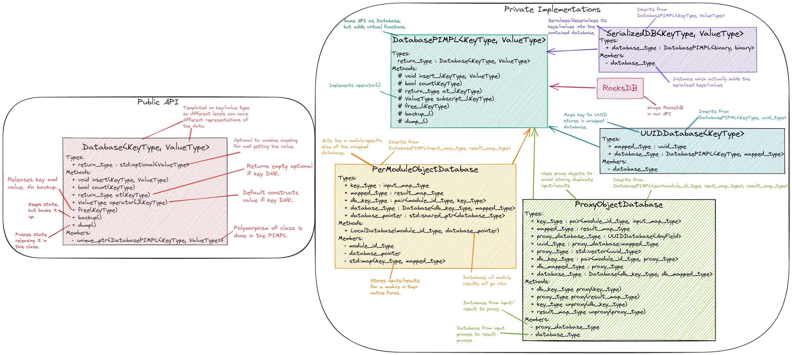
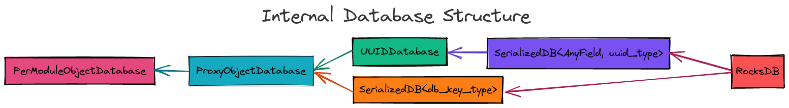

.. _database_design:

###############
Database Design
###############

This section explores the design considerations that went into selecting a
database backend for the ``Cache`` class. The TL;DR version is we're moving
forward with RocksDB.

*******************
What is a Database?
*******************

The usual definition is something along the lines of: a database is an organized
collection of data stored and accessed electronically. What really sets a
database apart from say a ``std::map``, or a spreadsheet, is that databases are
designed to contain a lot of data and to be accessed concurrently by a
potentially large number of users. The secret behind database performance is
that users do not directly interact with the a database, but rather they
interact with a database management system (DBMS). The DBMS is responsible for
managing access and memory based on user requests.

From the perspective of PluginPlay, the imporant things to note about most
modern databases are:

- API suports use as a key-value containers,
- designed with big data in mind, and
- your typical DBMS provides loads of features related to data retention,
  processing, and access.

Database Terminology
====================

The reader new to databases will quickly be inundated with jargon. This
subsection provides a small glossery of the most common terms.

ACID
   Stands for atomicity, consistency, isolation, and durability. Each
   transaction on a database must minimally satisfy these four properties for
   the database to be considered reliable.

CRUD
   Stands for create, read, update, and delete. These are the four foundational
   operations of any database.

DBMS
   Database management system. The library providing the API for interacting
   with a database.

MVCC
   Stands for multiversion concurrency control. MVCC avoids locks by storing
   multiple copies of the data. When data is updated a new version is added
   alongside older versions which may still be in use.

ODBC
   Open database connectivity. A standardized API for expressing database
   operations. The API is DBMS independent. Library developers can write their
   code using the ODBC API and it will work with whatever DBMS, the ODBC driver
   manager supports.

ORM
   Stands for object-relational mapping. Many common databases only support
   primitive data types like integers, floats, and strings. ORM is a technique
   where the objects are maintained in a virtual database and their members are
   mapped to enteries in the real database.

RDBMS
   Relational DBMS. A DBMS that specifically deals with relational databases.
   Relational databases are typically thought of as being tables with columns
   and rows.

SQL
   Structured query language. The de facto standard language for interacting
   with RDBMS.

WAL
   Stands for write-ahead logging. Techniques for the AC of ACID. Changes are
   first recorded in a log. The log is written to stable storage before being
   applied to the database. In the event of a restart the database can be
   compared to the log to figure out what operations need to be done still.

.. _database_considerations:

***********************
Database Considerations
***********************

The database backend is the lowest level of the ``Cache`` and is responsible for
addressing all memoization and checkpoint/restart (C/R) design considerations
which were not handled by :ref:`cache_design`. Summarily they are:

Parallel Nature of PluginPlay
=============================

- Avoid data races
- Will need to store parallel objects, sometimes in their distributed form and
  sometimes in a serialized form
- May want to use parallel filesystems for the checkpoint
- May want multiple checkpoint files
- Parallel systems may have more complicated memory hierarchies and we want to
  use them effectively.
- Resiliency to deal with hardware failures

Object Storage
==============

- Will need to serialize the objects
- Want a quick access (not serialized) and a long-term serialized form
- May not want to serialize all objects at the same frequency
- Compression (presumably of the serialized objects)
- Avoid storing multiple copies of the same key/value
- Users may want to customize the storage

Other
=====

- Automatic backups
- Diff support

   - Checkpoint the original state and the changes to the original state needed
     to make the current state

****************************
Choosing the Key/Value Types
****************************

We will use the database as an associative array. This means we need to choose
how the keys and values are stored in the array. There are a number of possible
representations which we list here.

Using the Literal Values
========================

Conceptually the simplest option is to use the literal values of the objects we
are storing.

Pros:

- human-readable keys (to the extent that the objects themselves are
  human-readable).
- Exact preservation of input values.
- Assuming value comparisons are implemented correctly, will never incorrectly
  memoize a call.

Cons:

- May lead to very costly comparisons (think large distributed data structures).

  - Ultimately it falls to the object writer to optimize the comparisons for
    their object; however, it's not always feasible to count on developers to be
    willing to further optimize their objects.

- Memory consumption may be a large issue.

  - Storing the literal values will result in copies of the objects
  - Can store references/pointers, but lifetime management becomes an issue.

- Value comparisons are sensitive to floating-point values

  - Could allow users to provide custom comparison operators thereby allowing
    them to choose what to do in such cases.
  - Object developers may have already considered this in the design of the
    comparison operators.

Using Hashes
============

Another option is to replace the objects with their hash representation.

Pros:

- Short look-up times (can be constant depending on the specific associative
  array implementation)
- Hash collisions aside, with the right hash algorithm the same object will
  always generate the same hash (i.e., we don't have to store the inputs, just
  the hashes)

Cons:

- All objects must be hashable. Places additional burden on object developers.
- Hashes can be very fragile

  - For a deterministic hash algorithm, one needs to prepare the input in the
    same state in order to guarantee the same hash. This can be difficult for a
    variety of reasons:

    - Operations which are equivalent in infinite precision arithmetic are in
      general not equivalent with finite precision arithmetic
    - Objects may have slightly different representations depending on the
      compiler, compiler settings, computing platform, etc.
    - Precision may be lost as a result of checkpointing (e.g. lossy
      compression, string to float conversions)

- Hash collisions are possible, albeit extremely unlikely with modern algorithms

  - Can perform a value comparison to guarantee the keys really are equal
    (requires storing the actual inputs too)
  - A notable exception to collision rarity occurs when two different objects
    have an unintentionally symmetric state. A common example is empty
    containers of different types; if one simply hashes the elements in the
    containers by looping over the container, and if the types of the containers
    are not hashed, the resulting hash value will be equal.

- Hashes are not human-readable (i.e. dumping a hash table is unlikely to be
  useful for anything other than memoization)

  - Combined with the fragility aspect, hashing is not suitable for long-term
    data archival

- Generally speaking, hashes can not be inverted, i.e., given just the hash it's
  not possible to determine what object was hashed.
- Distributed objects can be tricky

  - Can have each process hash its local part, requires no synchronization
  - Hashing the entire object requires synchrnoization

Universally Unique IDs (UUIDs)
==============================

UUIDs typically use some hardware-specific information combined with temporal
information to create a unique ID. Associating the UUID with a specific object
in effect creates a global memory address for the object.

Pros:

- Usage does not require the objects to be hashable
- Comparisons of UUIDs are quick
- Relatively straightforward to guarantee that the same UUID is not given to
  different objects.
- Could potentially serve as a sort of DOI for data-archival purposes

Cons:

- Requires bookkeeping to maintain the association between the UUID and the
  object it was generated for.

  - Adding a member to the class avoids needing to store a map from instance to
    UUID, but complicates the object's semantics (the UUID needs updated when
    the data changes).
  - Easy enough to automate with a mix-in

- Not human-readable
- Can not be inverted
- Requires synchronization to assign the same UUID to an object viewable by
  multiple processes

Digital Object Identifier
-------------------------

UUIDs are conceptually similar to DOIs, except that DOIs are issued by an
organization.

Pros:

- Widely used to identify journal articles, research reports, and data sets
- Uniquely identifies an object
- Using the DOI website allows users to easily obtain the actual object

Cons:

- Object needs to be registered with the International DOI Foundation to be a
  true DOI
- Costs money to get a DOI

************************
Database Implementations
************************

Databases are some of the most important software elements and are used in a ton
of applications. Thus it should come as no surprise that there are a lot of C++
options for databases. We have grouped the options based on whether they are
stand alone, or if they extend an existing database. This section is meant to be
a list of options with some notes, rather than an extensive comparison. The
next section provides a head-to-head comparison of the most promising options.

Stand Alone Options
===================

For the most part these are database projects which do not seem to be part of a
wider ecosystem. In many cases they are one-off projects, but in some cases the
lack of a wider ecosystem is simply because the project itself is all inclusive.
Ultimately, at the time of writing, none of the stand-alone options seem to be
stable and widely used (although a few seem to be moving in that direction).

- ClickHouse

   - https://github.com/ClickHouse/clickhouse-cpp
   - C++ client library for ClickHouse
   - column-oriened DBMS
   - data compression
   - disk storage
   - C++ API seems poorly documented and to rely on string parsing
   - Limited type support
   - Apache 2.0
   - Appears to be actively maintained. 143 stars and 22 watchers.

- Sophia

   - https://github.com/pmwkaa/sophia
   - MVCC key-value database
   - RAM-disk hybrid
   - Compression
   - BSD
   - Likely abandoned (last commit January 2019). 1.8K stars and 106 watchers.

- TileDB

   - https://github.com/TileDB-Inc/TileDB
   - Support for dense and sparse arrays, dataframes, key-value stores
   - Parallel I/O
   - Compression
   - Data versioning
   - Threaded
   - I/O and RAM versions
   - MIT License
   - Actively maintained. 1.3K stars and 61 watchers.

- Bedrock

   - https://github.com/Expensify/Bedrock
   - Networking and distributed transaction layer built atop SQLite
   - Does not appear to be a SQLite client
   - LGPL-3.0 License
   - Active development. 801 stars and 70 watchers.

- upscaledb

   - https://upscaledb.com/
   - Key-value based
   - Supports compression
   - can run in-memory database
   - Apache 2.0
   - Last commit Aug 2021. 521 stars and 40 watchers.

- simdb

   - https://github.com/LiveAsynchronousVisualizedArchitecture/simdb
   - single-file library
   - hash based key-value
   - Apache 2.0
   - Likely abandoned (last commit April 2018). 425 stars and 42 watchers.

- ObjectBox

   - https://objectbox.io/
   - Designed for embedded devices, internet of things, and mobile
   - Looks very invasive (have to wrap data members so ObjectBox knows about
     them)
   - Apache 2.0
   - Active development. 119 stars and 12 watchers.

- DTL

   - http://dtemplatelib.sourceforge.net/
   - Likely abandoned (last updated April 2013)

- EasyQTSql

   - https://github.com/kramolnic/EasyQtSql
   - Appears to be a wrapper around Qt's SQL library
   - Likely abandoned (last commit May 2019). 37 stars and 3 watchers.

- librethinkdbxx

   - https://github.com/AtnNn/librethinkdbxx
   - According to README it's still in early stages of development.
   - Apache 2
   - Likely abandoned (last commit Nov 2017). 91 stars and 17 watchers.

- memcached

  - https://github.com/memcached/memcached
  - effectively a distributed key/value database
  - AFAIK memcached is a server (an executable) so would need a C/C++ client
    to call it for cacheing purposes.
  - Documentation appears to be heavily web-based
  - BSD
  - Actively maintained. 11.6k stars and 704 watchers.

LevelDB
=======

LevelDB is a Google project which is widely used. Facebook used LevelDB for the
guts of its (also widely used) RockDB project. We are aware of three databases
which are part of the LevelDB ecosystem:

- LevelDB

   - https://github.com/google/leveldb
   - key/value arbitrary byte data
   - automatic compression
   - support for threaded access
   - can get snapshots (immutable representations)
   - Disk based (using mulitple files)
   - Checksums for data integrity
   - Appears to be actively maintained. 28.5K stars and 1.3K watchers.

- RocksDB

   - https://github.com/facebook/rocksdb
   - Built on LevelDB
   - Designed for storing data on flash drives
   - Can adapt to pure memory
   - Supports backups and checkpoints
   - GPLv2 or Apache 2.0
   - Appears to be actively maintained. 22K stars and 1K watchers.

- BerylDB

   - https://github.com/beryldb/beryldb
   - Built on RocksDB
   - Supports storing lists, sets, multimaps, and keys
   - BSD
   - Last commit November 2021. 197 stars and 6 watchers.

With the exception of BerylDB, these databases are quite well supported and seem
to be widely used.

LMDB
====

The lightning memory-mapped databse seems to have a small niche community
associated with it. While LMDB (and its derivatives) may be capable of high
performance, the seeming lack of wide usage makes us hesitant to use any of
these databases in our initial design.

- Lightning Memory-Mapped Database

   - https://www.symas.com/lmdb
   - Developed as part of the `OpenLDAP project <https://www.openldap.org/>`
   - key-value based
   - Webpages is a bit of a maze
   - OpenLDAP Public License
   - GitHub mirror hasn't been updated since Jun 2021. 1.9K stars and
     158 watchers.

- libmdbx

   - https://github.com/erthink/libmdbx
   - Descendant of LMDB
   - Appears to be in a transition period to MithrilDB
   - OpenLDAP Public License
   - Active development. 1K stars and 48 watchers.

- lmdbxx

   - https://github.com/drycpp/lmdbxx
   - C++ wrapper for LMDB
   - Single header
   - Unlicense license
   - Likely abandoned (last commit Feb 2016). 247 stars and 17 watchers.

MySQL
=====

MySQL is one of the most popular databases in use; however, the only C++-client
we are aware of does not seem to be well utilized.

- MySQL++

   - https://github.com/tangentsoft/mysqlpp
   - LGPLv2
   - Last commit Dec 2021. 44 stars and 4 watchers.

      - GitHub repo is an official mirror (so statistics may not be accurate)

MongoDB
=======

MongoDB is a database which has been growing in popularity. Its primary feature
of interest seems to be that it describes data in a JSON-like manner, which
makes it immediately applicable to object-oriented programming.

- mongo-cxx-driver

   - https://github.com/mongodb/mongo-cxx-driver
   - Apache 2.0
   - Actively maintained. 869 stars and 131 watchers.

- mongo-c-driver

   - https://github.com/mongodb/mongo-c-driver
   - Same organization as the C++ driver
   - Likely has a similar feature set to the C++ driver
   - Apache 2.0
   - Actively maintained. 716 stars and 81 watchers.

PostgreSQL
==========

Not sure what features of PostgreSQL set it apart from say Redis, but it seems
to be a widely used SQL database.

- libpqxx

   - http://pqxx.org/development/libpqxx/
   - Official C++ API for PostgreSQL
   - BSD
   - Active development. 606 stars and 36 watchers.

- pgfe

   - https://github.com/dmitigr/pgfe/
   - Zlib License
   - Active development. 111 stars and 10 watchers.

- taoPQ

   - https://github.com/taocpp/taopq
   - Boost Software License
   - Active development. 191 stars and 17 watchers.

While none of these libaries appear to widely used, we note that PostgreSQL is
itself widely used, and libpqxx is the official C++ PostgreSQL implementation.
The implication is that libpqxx appears to have support for the immediate
future at least.

Redis
=====

Like PostgreSQL, I'm not sure what really sets Redis apart; however, it seems to
be another popular choice.

- Hiredis

   - https://github.com/redis/hiredis
   - C client library for interacting with a Redis database
   - BSD
   - Actively maintained. 5.2K stars and 303 watchers.

- cpp_redis

   - https://github.com/cpp-redis/cpp_redis
   - C++11 Asynchronous multi-platform lightweight Redis client
   - MIT license
   - Last commit Aug 2021. 478 stars and 29 watchers.

- redis-cpp

   - https://github.com/tdv/redis-cpp/
   - Based on hiredis
   - MIT License
   - Last commit Nov 2021. 61 stars and 10 watchers.

- redis-plus-plus

   - https://github.com/sewenew/redis-plus-plus
   - Apache 2.0
   - Active development. 743 stars and 25 watchers.

- redis3m

   - https://github.com/luca3m/redis3m
   - Wraps hiredis in a C++ API
   - Apache 2.0 License
   - Likely abandoned (last commit May 2019). 182 stars and 30 watchers.

- cpp-bredis

   - https://github.com/basiliscos/cpp-bredis
   - header-only
   - synchronous and asynchronous APIs
   - MIT
   - Last commit December 2021. 140 stars and 11 watchers.

- aredis

   - https://github.com/lordoffox/aredis
   - No documentation, just a short code snippet.
   - Boost Software License
   - Likely abandoned (last commit May 2018). 26 stars and 5 watchers

While Redis seems to have the most libraries, Hiredis and redis-plus-plus seem
to be the only two being widely used.

SQLite
======

Again I'm not sure what sets SQLite apart, but it seems to be pretty popular.

- SQLiteC++

   - https://github.com/SRombauts/SQLiteCpp
   - Actively maintained. 1.4K stars and 75 watchers.

- SQLite ORM

   - https://github.com/fnc12/sqlite_orm
   - Supports custom types
   - STL compatible
   - Supports memory and disk databases
   - GNU Affero General Public License
   - Last commit December 2021. 1.5K stars and 61 watchers.

- sqlite modern cpp wrapper

   - MIT License
   - Doesn't seem to support custom types
   - Likely abandoned (last commit November 2020). 671 stars and 58 watchers.

- hiberlite

   - ORM for SQLite relying on a Boost Serialization-like API
   - Aside from the serialization-like API not sure what other features it has
   - BSD
   - Likely abandoned (last commit June 2018). 614 stars and 58 watchers.

- VSQLite++

   - https://github.com/vinzenz/vsqlite--
   - C++ wrapper for SQLite3
   - Little documentation.
   - BSD
   - Likely abandoned (last commit Nov 2020). 27 stars and 5 watchers.

Like Redis, the majority of the libraries associated with SQLite do not seem to
be widely supported. SQLiteC++ and SQLite ORM are the exceptions; however, the
license of SQLite ORM means it's not viable for our purposes.

Multiple Databases
==================

The options in this category provide interfaces to more than one database type.
For the most part we didn't give these libraries too much consideration instead
opting to focus on a single backend.

- nanodbc

   - https://github.com/nanodbc/nanodbc
   - Interacts with multiple DBMS through the ODBC C API.
   - MIT license
   - Active development. 228 stars and 17 watchers.

- ODB

   - https://www.codesynthesis.com/products/odb/
   - Interface to MySQL, SQLite, PostgreSQL, Oracle, and Microsoft SQL.
   - GPLv2
   - Actively maintained.

- OTL

   - http://otl.sourceforge.net/
   - C++ template library for interacting with Oracle, ODBC, DB2-CLI
   - Actively maintained.

- QTL

   - https://github.com/znone/qtl
   - Supports MySQL, SQLite, PostgreSQL, and ODBC
   - Apache 2.0
   - Last commit Oct 2021. 130 stars and 10 watchers.

- QxORM

   - https://www.qxorm.com/qxorm_en/home.html
   - SQLite, MySQL, PostgreSQL, Oracle, Microsoft SQL, MongoDB
   - GPLv3 or under the QxORM Propietary License (if you pay)

- SOCI

   - https://github.com/SOCI/soci
   - Common API for a number of backend databases including: DB2, Firebird,
     MySQL, ODBC, Oracle, PostgreSQL, and SQLite 3
   - Boost Software License
   - Actively maintaiend. 1.1K stars and 100 watchers.

- SQLAPI++

   - https://www.sqlapi.com/
   - Propietary interface to Oracle, SQL Server, DB2, Sybase, MySQL, MariaDB,
     PostgreSQL, SQLite, Informix, Interbase, Firebird, SQLBase, SQL Anywhere,
     and ODBC
   - SQLAPI++ Library License

- sqlpp11

   - https://github.com/rbock/sqlpp11
   - MariaDB, MySQL, PostgreSQL, SQLite3, and SQLCipher
   - BSD
   - Active development. 1.9K stars and 115 watchers.

- Tntdb

   - https://github.com/maekitalo/tntdb
   - Supports SQLite, MySQL, Postgresql, and Oracle
   - LGPL-2.1
   - Actively maintained. 30 stars and 13 watchers.

***********************************
Database Implementation Comparsions
***********************************

The goal of this section is to come to a decision on what database to use. To
this end we have enumerated a set of features we are looking for.

#. Widely supported

   - The database is going to be an integral part of PluginPlay. We don't want
     to adopt a solution which looses support in a few years.

#. Stable.

   - While new products can be exciting, we're looking for something with an
     API which isn't constantly changing.

#. License.

   - We use Apache 2.0 so whatever we pick needs to be licensed in such a
     manner that it works with our license.

#. Thread.

   - The DBMS should handled thread concurrency for us. This can often be
     handled more effeciently closer to the database than the DBMS API allows
     us to get.
   - Technically this is probably part of ACID
   - Process concurrency is nice, but it's not clear we're going to find it.

#. Object-oriented programming (OOP).

   - Should support storing objects in their native form when they are in
     memory and serializing/deserializing them to put them on disk.
   - This is probably a nice to have, not a requirement because we can keep
     the objects in a buffer if need be.

#. Disk.

   - Is the database's location based off a filesystem/disk location or an IP?
   - It seems like a lot of commercial applications want to use IP
     addresses for specifying the location of the database, i.e. the
     client-server model.
   - Parallel filesystems, for example, usually use disk locations
   - IP-based databases usually have some support for local hosts.
   - At least on Linux, you can use something like SSHFS to mount remote
     files, but it requires admin privileges.
   - With some indirection it should be possible to use IP and disk-based
     databases interchangeably,
   - Given how most supercomputers mount parallel filesystem, we prefer
     disk-based APIs over IP-based, if only because it doesn't require
     workarounds. Conceivably we worry that privileges may prohibit use of
     IP-based databases on supercomputers, although how founded this worry is,
     is not clear.

#. ACID

   - Databases which are ACID compliant will take care of resiliency for us.

#. Binary.

   - Generally speaking objects will not be directly supported by most
     databases.
   - Schema are the usual way around this, but only practical for small to
     medium-sized objects
   - For large objects want to be able to dump the binary representation

The previous section listed a lot of C++ database solutions. Our focus on
solutions which are widely supported, stable, and licensed compatibly with
PluginPlay narrows the field considerably. The following table summarizes how
the viable databases stack up.

.. note::

   As a disclaimer, at this time we do not have any experience with the
   databases on this list and the comparisons are being done off the provided
   documentation, and in some instances a quick perusal of the source code. This
   means the various DBMS may actually have (or not have) features that the
   table says they do not have. It should also be noted that unless we found
   some evidence that a DBMS has a feature we assumed it did not.

.. |o| replace:: ✅
.. |x| replace:: ❌

+------------------+--------+-----+------+------+--------+
| Database Name    | Thread | OOP | Disk | ACID | Binary |
+==================+========+=====+======+======+========+
| LevelDB          | |o|    | |x| | |o|  | |x|  | |o|    |
+------------------+--------+-----+------+------+--------+
| RocksDB          | |o|    | |x| | |o|  | |o|  | |o|    |
+------------------+--------+-----+------+------+--------+
| mongo-cxx-driver | |x|    | |o| | |x|  | |o|  | |o|    |
+------------------+--------+-----+------+------+--------+
| libpqxx          | |x|    | |x| | |x|  | |o|  | |o|    |
+------------------+--------+-----+------+------+--------+
| Hiredis          | |o|    | |x| | |x|  | |o|  | |o|    |
+------------------+--------+-----+------+------+--------+
| redis-plus-plus  | |o|    | |x| | |x|  | |o|  | |o|    |
+------------------+--------+-----+------+------+--------+
| SQLiteC++        | |o|    | |x| | |o|  | |o|  | |o|    |
+------------------+--------+-----+------+------+--------+

On the basis of the head-to-head comparison the most promising choices seem to
be RocksDB, or SQLiteC++. In our opinion RocksDB is a better choice than
SQLiteC++ because mapping the key-value API of RocksDB to our application is
more straightforward than mapping the SQL-based API of SQLiteC++.

*****************
Database Strategy
*****************

.. _fig_db_design:

   Class diagram for the ``Database`` backend implementing the ``Cache``. N.B.
   on most browsers you can "open image in a new tab" to easily zoom in.

Ultimately none of the databases we considered have all of the features we want.
Our current Database strategy grafts the missing functionality onto RocksDB.
The class structure for our ``Database`` class is summarized in
:numref:`fig_db_design`. The general design strategy is to rely on nesting
polymorphic PIMPLs to acheive an implementation with the desired properties. Our
initial database PIMPL has four levels. For our first pass we only worry about
storing keys/values locally. That is each process's ``Database`` will be
responsible for storing the local piece of distributed objects, or copies of
replicated objects. In general this means each process's ``Database`` instance
will have a different state. Additional parallel considerations can be tackled
by implementing additional backends, and  will be left for future work.

The most fundamental PIMPL is the ``RocksDB`` class. This class is a thin
wrapper around the RocksDB library. Keys/values in the ``RocksDB`` database need
to be binary. To go from C++ objects to binary we introduce the ``SerializedDB``
PIMPL. This PIMPL is responsible for serializing data into the database it wraps
and deserializing data upon request. Our design has two PIMPLs which wrap
``SerializedDB`` instances; the first, is the ``UUIDDatabase``, and the second
is the ``ProxyObjectDatabase``. The ``UUIDDatabase`` class is responsible for
mapping its keys to UUIDs. The UUIDs will ultimately be used as proxies for the
actual module inputs/results (each set of inputs/results is replaced with a
``std::vector`` of UUIDs). The ``ProxyObjectDatabase`` wraps two databases: a
``UUIDDatabase`` (defining the actual input/result to UUID mapping) and a
``SerializedDB`` instance which defines (via the proxy objects) the input set to
result set mappings. Finally the ``PerModuleObjectDatabase`` stores an in-memory
mapping from the input set to the result set (for a specific module).

.. _fig_db_pimpl_design:

   Structure of the PIMPL implementing the ``Database`` class. See text for more
   details.

In practice, as results are put into the ``Cache`` they first go into the
``PerModuleObjectDatabase``. This allows fast retrieval of memoized
inputs/results. When checkpointing is needed, or space is an issue, the
``PerModuleObjectDatabase`` object flushes its memoized results to the wrapped
database (which presently is a ``ProxyObjectDatabase``). The exact behavior of
what happens after flushing the ``PerModuleObjectDatabase`` (or even how the
``PerModuleObjectDatabase`` works) can be modified by creating (and nesting)
more ``DatabasePIMPL`` objects. The overall initial structure of the
``DatabasePIMPL`` used to implement the ``Database`` in the Cache is shown in
:numref:`fig_db_pimpl_design`.

Database Considerations Addressed
=================================

This section explains how our current database strategy addresses the
considerations raised in the :ref:`database_considerations` section.

- Avoid data races

   - RocksDB is designed to avoid data races
   - To the extent that the underlying ``RocksDB`` instance is the single source
     of truth, data races should be largely avoidable in the other PIMPL classes
     too.
   - The notable exception is the ``PerModuleObjectDatabase`` which contains a
     ``std::map`` that is not thread-safe. Data races here may lead to missed
     memoization opportunities. If profiling reveals this to be an issue we will
     return to this issue.

- Will need to store parallel objects, sometimes in their distributed form and
  sometimes in a serialized form

   - ``PerModuleObjectDatabase`` only stores the local piece of distributed
     objects. For pure memoization this is what you want.
   - With our design how an object is stored under ``PerModuleObjectDatabase``
     depends on how ``RocksDB`` is set-up and on how serialization is
     implemented.
   - ``RocksDB`` ultimately writes to whatever file it's told to. The two main
     choices are to have each process/node write to a different file, or to have
     all processes/nodes write to the same file (presumably on a parallel
     filesystem)
   - If serialization only serializes the local part, ``RocksDB`` should be
     set up so each node writes to either a single file or different files
   - If serialization serializes the entire distributed state, then ``RocksDB``
     should be setup to write to the same file to avoid duplication.
   - We leave it to the user to setup the backend correctly (with the aid of
     convenience functions we provide).
   - For SPSD (single-process, single-data) and (single-process, multiple-data)
     having per node databases either means all of the databases are the same
     or they are effectively the same as long as the data distribution doesn't
     change (including on restart).
   - We're primarily targeting SPMD and can add more backends to deal with other
     scenarios at a later point.

- May want to use parallel filesystems for the checkpoint

   - RocksDB writes the database to the provided file. Providing a filename that
     is located on a parallel filesystem will result in the database being
     written to the parallel filesystem.

- May want multiple checkpoint files

   - Again this can be controlled by what file RocksDB writes to.

- Parallel systems may have more complicated memory hierarchies and we want to
  use them effectively.

   - Additional PIMPLs can be added to say put objects in non-volatile memory
     before going to disk if need be.

- Resiliency to deal with hardware failures

   - Built into RocksDB

- Will need to serialize the objects

   - Happens in ``SerializedDB``, will require all ``AnyField`` instances to be
     serializable.
   - May need different serializations (only the local part, entire object)

- Want a quick access (not serialized) and a long-term serialized form

   - Quick-access is provided by ``PerModuleObjectDatabase``, long-term by
     RocksDB

- May not want to serialize all objects at the same frequency

   - Additional dispatch options can be built into the PIMPLs as needed.

- Compression (presumably of the serialized objects)

   - Native RocksDB feature

- Avoid storing multiple copies of the same key/value

   - ProxyObjectDatabase addresses this by assigning UUIDs to each input and
     result.

- Users may want to customize the storage

   - Exactly how objects get cached can be controlled by the PIMPL. Our plan is
     to provide convenience functions for common scenarios (e.g. our default
     cacheing strategy, no long-term backups, no memoization whatsoever)
   - No memoization can be implemented by not instantiating a Cache
   - Similarly "no long term" backup can be iimplemented by leaving off the
     ``SerializedDB`` part of the PIMPL.

- Automatic backups

  - Can be done with a new backend

- Diff support

   - Requires a new backend

*****************
Future Directions
*****************

While our design addresses all of the considerations to some extent, our initial
design will punt on some aspects. We collect those aspects here for future
reference.

- data races: not all classes are thread-safe
- storing distributed objects: may want a global database, the ability to synch
  UUIDs etc.
- HPC memory hierarchies: we will need new backends to use specialized hardware
- different frequency serialization: will require a new backend
- Automatic backups: will need a new backend
- Diff support: will need a new backend
- Other backends: design should allow for other backends beside RocksDB
