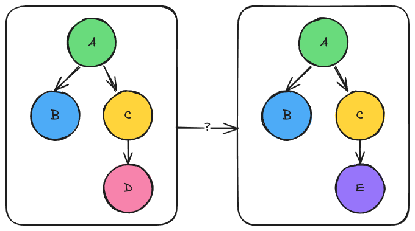

Driver Module Design

*******************
Why Do We Need XXX?
*******************

#. Facilitate swapping multiple modules
#. Module conglomerates

These needs are summarized in more detail below:

Switching Multiple Modules
==========================

.. _fig_switching_modules:

   Left the original graph. Right the graph resulting from using module "E"
   instead of "D". The question is how can both graphs be loaded into the
   ``ModuleManager`` simultaneously?

Consider the two graphs shown in :numref:`_fig_switching_modules`. Let's call
the left graph "L" and the right graph "R". If we choose to have graph "L" be
the default graph that is loaded into the ``ModuleManager`` the user can go
from  graph "L" to graph "R" by telling the ``ModuleManager`` to switch the
submodule node "C" uses from node "D" to node "E". While viable, this is not
necessarily user-friendly as running "R" vs "L" means the user needs to know to
switch "D" to "E".

If we wanted to make it easy to run both "R" and "L" one option is to make
copies of the "A" and "C" modules. Let "RA" and "RC" respectively be those
copies. Then it becomes possible to have both the "L" and "R" graphs loaded into
the ``ModuleManager`` by default. More specifically, "L" is loaded in in the
same manner, "R" is loaded in by having "RC" call "E" and "RA" call "B" and
"RC". While this solution works, it can be tedious depending on how nested
the graph is. It also can be wasteful because the two graphs may have a
substantial amount of overlap.

Module Conglomerates
====================

API
***

template<typename PropertyType>
std::tuple<InputMap, SubmoduleMap>
ModuleDriver::pre_run_(InputMap inputs, SubmoduleMap submods);

template<typename PropertyType>
ResultMap ModuleDriver::run_(InputMap inputs, SubmoduleMap submods);

template<typename PropertyType>
ResultMap ModuleDriver::post_run_(InputMap inputs, SubmoduleMap submods, ResultMap results);
