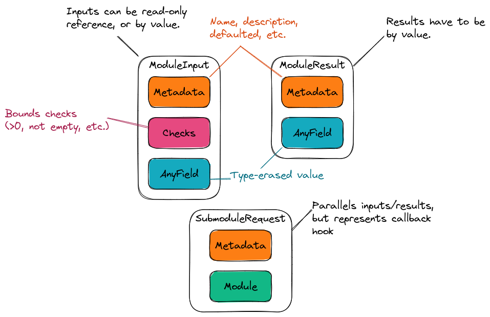

.. Copyright 2023 NWChemEx-Project
..
.. Licensed under the Apache License, Version 2.0 (the "License");
.. you may not use this file except in compliance with the License.
.. You may obtain a copy of the License at
..
.. http://www.apache.org/licenses/LICENSE-2.0
..
.. Unless required by applicable law or agreed to in writing, software
.. distributed under the License is distributed on an "AS IS" BASIS,
.. WITHOUT WARRANTIES OR CONDITIONS OF ANY KIND, either express or implied.
.. See the License for the specific language governing permissions and
.. limitations under the License.

.. _field_design:

#############################
Designing the Field Component
#############################

:ref:`property_type_design` and :ref:`module_design` both called for a 
mechanism to handle fields.

****************************
What is the Field Component?
****************************

Modules are meant to be black-box functions which take all the input (inputs 
and callbacks) they will need to compute their results. The inputs and
results are the fields. Since callbacks are passed as inputs we consider how
they are passed to be part of the field component, while the actual callback
mechanism falls to the call graph component (see :ref:`call_graph_design`).

******************************
Field Component Considerations
******************************

#. Work with arbitrary types.

   - Downstream users of PluginPlay should be able to use their native types.

#. Recognize differences between inputs and results.

   - Inputs can be by value or by read-only reference.
   - Results are always by value.
   - Note can move into a value argument.

#. Record provenance of inputs/results.

   - The inputs/results should hold metadata to sufficiently describe them.
   - Metadata can conceivably be used by callers of the module as a "tooltip"

#. Verify inputs satisfy bound constraints.

   - Associating checks with the field avoids waiting until the module runs to
     ensure the field's value is valid.
   - Used to prevent users from setting a field to an incorrect value (before
     the module tries to unwrap the input). 

#. Leverage metadata to generate documentation.

   - Keeping documentation up to date with :ref:`api` changes can be tedious.
   - Generating documentation from metadata keeps code and documentation
     synched.

**********************
Field Component Design
**********************

.. _fig_field_design:

   The three major components of PluginPlay's field component. ModuleInput/
   ModuleResult are responsible for respectively managing the inputs/results
   to/from a module and SubmoduleRequest is used to manage callback hooks.

:numref:`fig_field_design` shows the architecture of the field component.
The three major components, ``ModuleInput``, ``ModuleResult``, and 
``SubmoduleRequest`` correspond to three major items passed into/from modules.
``ModuleInput``  manages an input to a module (the set of inputs passed to a
module will be a container of ``ModuleInput`` objects). In addition to the
type-erased input, which lives in the ``AnyField`` object, the ``ModuleInput``
also holds metadata (*e.g.*, a description, if the user set the value, is
the value :ref:`opaque`) and any bounds checks (*e.g.*, can the value be null, 
is there a maximum/minimum for the value, what are the allowed strings). The
``ModuleResult`` is similar except it does not have bounds checks (the
module developer presumably is not trying to return invalid results). The
``SubmoduleRequest`` class is designed to hold a callback hook, and the callback
once it is set.

Summary
=======

#. Work with arbitrary types.

   - ``AnyField`` uses type-erasure to wrap whatever type the module developer
     and/or property type developer wants.
   - Types live in the module implementation or in the property type, both of
     which live downstream from PluginPlay.

#. Recognize differences between inputs and results.

   - ``ModuleInput`` and ``ModuleResult`` are different classes to better
     capture this point.

#. Record provenance of inputs/results.

   - All classes have metadata to record provenance.

#. Verify inputs satisfy bound constraints.

   - ``ModuleInput`` has the ability to store bounds checks the input values
     must satisfy.

#. Leverage metadata to generate documentation.

   - Not strictly part of the field component, but the field component exposes
     enough information for another component to generate the documentation.