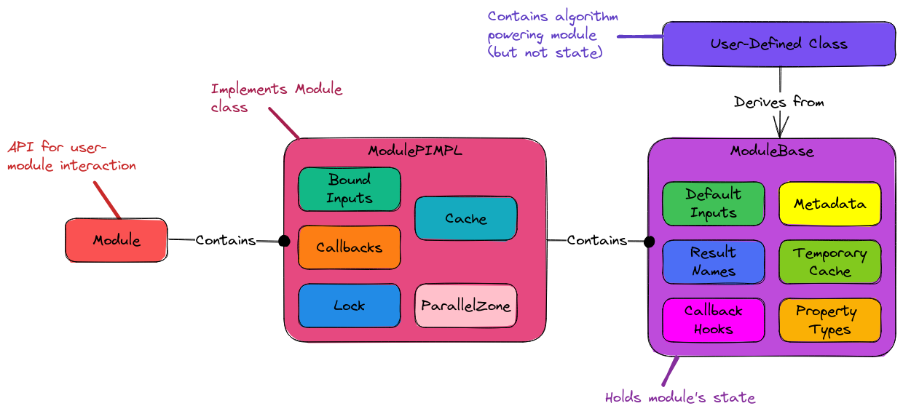
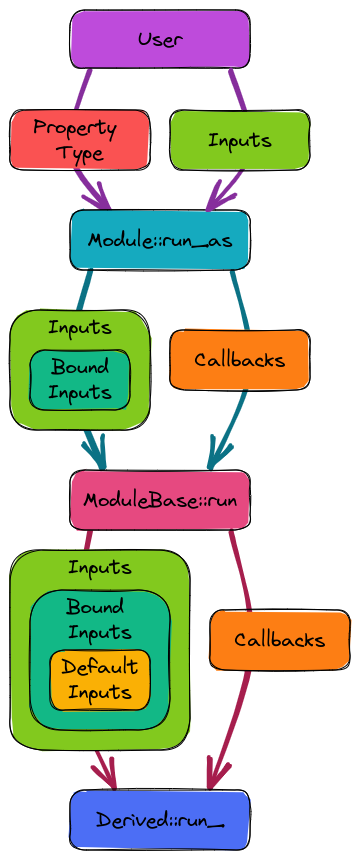

.. Copyright 2023 NWChemEx-Project
..
.. Licensed under the Apache License, Version 2.0 (the "License");
.. you may not use this file except in compliance with the License.
.. You may obtain a copy of the License at
..
.. http://www.apache.org/licenses/LICENSE-2.0
..
.. Unless required by applicable law or agreed to in writing, software
.. distributed under the License is distributed on an "AS IS" BASIS,
.. WITHOUT WARRANTIES OR CONDITIONS OF ANY KIND, either express or implied.
.. See the License for the specific language governing permissions and
.. limitations under the License.

.. _module_design:

##############################
Designing the Module Component
##############################

The :ref:`call_graph_design` section motivated the need for a module component
(although the fact that we've written "module" like a thousand times by now
ought to have suggested it too...).

*****************************
What is the module component?
*****************************

See :ref:`module` for PluginPlay's definition of a module. The module component
is primarily responsible for interfacing PluginPlay to the algorithm the
module developer wrote.

*******************************
Module Component Considerations
*******************************

Based on the discussions in the :ref:`call_graph_design` section, the module
component must:

#. Provide a mechanism for a user to interface their algorithm with PluginPlay

#. Leverage cache component for memoization

   - Ideally largely automated
   - Developers may need mark modules as incapable of being memoized when they
     are not sufficiently "pure" (*i.e.*, they have side effects, are
     non-deterministic, and/or depend on global input).

#. Have a setup phase (presumably in the constructor)

   - Used by developer to register the module's metadata.
   - Also can initialize constant state needed by the module.

#. Expose a ``run`` member for actually running the module

#. Have the ability to store call-back points.

***********************
Module Component Design
***********************

.. _fig_module_design:

   Module component design showing the contact points. Users of the
   module go through the ``Module`` class :ref:`api`. PluginPlay interacts with
   the user of the module via the ``ModulePIMPL`` class and the module developer
   via the ``ModuleBase`` class. Module developers interact with the component
   by deriving from ``ModuleBase``.

The design of the module component is shown in Fig :numref:`fig_module_design`.
The subsections below go over the major pieces in more detail.

Module Development
==================

Following traditional object-oriented practices module developers implement
modules by deriving from the ``ModuleBase`` class. In the constructor of their
module, module developers set the property type(s) their module satisfies,
any additional inputs/results (beyond those specified by the property type),
callback hooks used throughout, and the metadata (version, author, papers to
cite, *etc.*). The actual state provided in the constructor is stored in the
``ModuleBase`` part of the object and preserved in the state provided. When
users change inputs, or callbacks the user's requests are actually stored in
the ``ModulePIMPL``. 

The other half of implementing a module is done when the module developer
overrides the ``run_()`` member. This member is assumed to be a pure function
(a pure function always returns the same results for the same inputs, and has
no side-effects). PluginPlay helps enforce this assumption by making the
``run_()`` member ``const``. The need for a pure function is brought on by the
desired black-box nature and for memoization purposes. To be treated as a black
box the module must receive no "hidden" inputs including from global variables,
files, or state not registered with PluginPlay. In practice, particularly when
considering modules meant to be called iteratively, a module may need access
to modifable state. This is where the "Temporary Cache" comes in. The derived
class is able to put/get data in/out of the temporary cache using a key-value
system.

Module Usage
============

.. _fig_calling_a_module:

   How inputs traverse the module component.

Fig. :numref:`fig_calling_a_module` depicts the process of a user interacting,
*i.e.*, calling, the module. First, the user selects the property type to run
the module as. The property type defines the inputs the user must provide, and
the user passes the appropriate inputs into the ``Module`` class. Inside the
``Module``, the bound inputs are added to the user's inputs (for each bound
input, it is added only if it does not override a user specified input). The
``Module`` (actually the ``ModulePIMPL``) then forwards the combined inputs,
and the bound callbacks, to the ``ModuleBase`` class. The ``ModuleBase`` class
unifies the provided inputs with the default inputs (again only adding a 
default input if it does not override a provided input) and forwards the final
set of inputs and the callbacks to the derived class. Returning values is much
simpler as there are no default/bound returns and results are simply forwarded
from the derived class through the ``ModuleBase``, ``ModulePIMPL``, and 
``Module`` classes. To aid in memoization/parallelization the ``ModulePIMPL``
locks during the aforementioned process to avoid concurrent modifications to
its state.

While not shown in Fig. :numref:`fig_calling_a_module`, memoization occurs in
the ``ModulePIMPL`` class (``ModuleBase`` is shared by all instances of the
same module and, with the exception of the temporary cache, read-only). The
design of the memoization process is covered in more detail 
in :ref:`memoization_design`. For our current purposes it suffices to say that
the user-provided inputs, unified with the bound inputs and the callbacks, are
used as a key to the cache (which is module-base specific). If that key is
found the result is simply returned, otherwise ``ModuleBase::run`` is called.

Summary
=======

The above design specifically addresses the stated considerations by:

#. Provide a mechanism for a user to interface their algorithm with PluginPlay

   - Module developers inherit from ``ModuleBase`` and fill in the virtual
     ``run_`` member.
   - Metadata for the module can be registered with ``ModuleBase`` (and thus
     PluginPlay) in the derived class's ctor.

#. Leverage cache component for memoization

   - ``ModulePIMPL`` performs memoization.

#. Have a setup phase (presumably in the constructor)

   - Derived classes use their constructor

#. Expose a ``run`` member for actually running the module

   - ``Module`` exposes the ``run`` (and more useful ``run_as``) which
     executes the module.     

#. Have the ability to store call-back points.

   - ``ModuleBase`` records the hooks (property types and associated tag) for
     each call back location.
   - ``ModulePIMPl`` holds the bound callbacks for each hook.