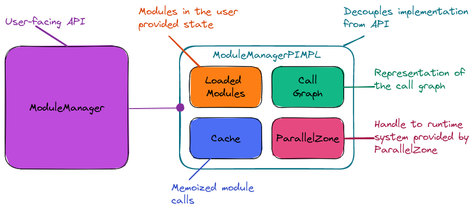
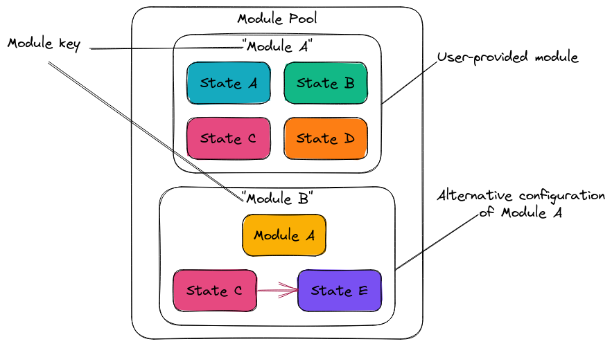

.. Copyright 2022 NWChemEx-Project
..
.. Licensed under the Apache License, Version 2.0 (the "License");
.. you may not use this file except in compliance with the License.
.. You may obtain a copy of the License at
..
.. http://www.apache.org/licenses/LICENSE-2.0
..
.. Unless required by applicable law or agreed to in writing, software
.. distributed under the License is distributed on an "AS IS" BASIS,
.. WITHOUT WARRANTIES OR CONDITIONS OF ANY KIND, either express or implied.
.. See the License for the specific language governing permissions and
.. limitations under the License.

.. _module_manager_design:

############################
Designing the Module Manager
############################

:ref:`pp_architecture` calls for a module manager component which will be
the user-facing :ref:`api` of PluginPlay. This section describes the design of
that component.

***************************
What is the module manager?
***************************

Based on object-oriented design principles we need an object to represent the
PluginPlay framework. The majority of interactions with the framework can be
summarized as "module management" so we have opted to call the corresponding
component the "module manager" and the literal class ``ModuleManager``.

*****************************
Module Manager Considerations
*****************************

Since the module manager is the user-facing :ref:`api` every major feature of
PluginPlay needs to be accessible through it. This means the module manager
component needs to support:

#. Dynamic module management

  - Users may hard-coded some configuration, but ultimately
    users also need to be able to override those configurations at runtime.
  - The state of the framework needs to adapt to changes in real time
  - The state of the framework needs to be query-able  in real time.
  - Responsible for lifetime of modules (and framework)

#. Managing of :ref:`module` pool

   - Need to be able to load, remove, *etc.* :ref:`module` objects
   - Iterate over, list, count, *etc.* loaded :ref:`module` objects
   - Discern among different configurations

#. Modify call graph

   - Change which :ref:`submodule` a :ref:`module` calls
   - Change inputs bound to :ref:`module` objects

#. Run call graph

   - Once the call graph is setup need to actually be able to run it.
   - Running call graph should be efficient/performant

#. Saving, loading, and restarting a previous session

   - Intermediates can be expensive, need to manage size of save state
   - May need to go from distributed state to single node, vice versa

***************************
Module Manager Architecture
***************************

.. _fig_mm_arch:

   Architecture of the module manager component.

Fig. :numref:`fig_mm_arch` shows the architecture of the module manager
component. The user-facing :ref:`api` is codified by a ``ModuleManager`` class.
Using the :ref:`pimpl` idiom, the implementation of the ``ModuleManager`` (and
PluginPlay itself) is separated from the :ref:`api`. The current design
actually has the call graph, cache, and ParallelZone components residing
within the ``ModuleManagerPIMPL`` (not as separate from the ``ModuleManager``
as shown in :numref:`fig_pp_arch_full`). This is primarily for convenience,
but since it is in the :ref:`pimpl`, they could be separated out later
if need be.

With the exception of the "Loaded Module" component (which we discuss in more
detail below). The remainder of the ``ModuleManagerPIMPL``'s state was also
present in top-level architecture diagram and has simply passed through. The
design of the module manager component punts many of the module manager
considerations to these components (see summary below), but provides
user-facing APIs for doing them.

Module Pool
===========

.. _fig_mm_module_pool:

   Architecture of the "Loaded Module" component, *i.e.*, a module pool.

The new component here is the "Loaded Module" component, which is an associative
array of loaded modules used like a :ref:`module` pool. Conceptually the main
points of this pool are summarized in Fig. :numref:`fig_mm_module_pool`. Here
our user has loaded one module under the module key ``"Module A"`` (we'll
discuss ``"Module B"`` below). Module keys are used to refer to the modules
in the module pool. Each module choice has a unique key meant to facilitate
referring back to a specific module.

When the user loads ``"Module A"``, ``"Module A"`` is inserted into the module
pool as is. Fig. :numref:`fig_mm_module_pool` depicts ``"Module A"`` as having
four, members. The values of these four members, define the default state for
``"Module A"``. If a user does not want to use ``"Module A"`` in its default
state, they can create a new configuration. This is what ``"Module B"``
represents in Fig. :numref:`fig_mm_module_pool`, *i.e.*, ``"Module B"`` is a
different configuration of ``"Module A"`` which differs in that the value of
``Member C`` is replaced with some new value ``Member E``. Thus configurations
are stored as differences. That is to say each configuration contains a link to
the original module and a list of changes to apply. Note that by design, aside
from the different value for the third member, to PluginPlay users and the call
graph, ``"Module B"`` is indistinguishable from ``"Module A"``. This avoids
placing any special emphasis on the default configuration.

Preserving the original state of the module is an important design point.
First, it establishes a default configuration, from which we can define our
differences. Second it facilitates recording provenance. When looking back at a
previous session it can be important to know if the value used was the default
value, or if the user set the value. Note that module defaults can change over
time, which makes it harder to ascertain this information if it is not
recorded.  The third, and primary reason for preserving the original state is
we necessarily treat each module as a black-box. Therefore we want to avoid
copying the module on account of not knowing how expensive the copy actually
will be.

Summary
=======

The current design of the module manager really only directly addresses concern
two (*i.e.*, managing of :ref:`module` pool) and punts the remaining concerns.
More specifically:

# Dynamic module management

  - Operations go through ``ModuleManager`` class
  - Different configurations handled by module pool
  - Module pool is query-able and modifiable in real time
  - Call graph handles querying and modifying modules comprising program

#. Managing of :ref:`module` pool

   - Explicit component of the current design

#. Modify call graph

   - User/call-graph interactions go through ``ModuleManager``
   - Actual interactions fall to call graph component

#. Run call graph

   - Running the call graph done through ``ModuleManager``, but actual execution
     falls to call graph component
   - Efficiency tied to memoization and falls to the cache and call graph
     components

#. Saving, loading, and restarting a previous session

   - User-facing :ref:`api` is exposed through ``ModuleManager``
   - Falls to cache and call graph component (memoization)
