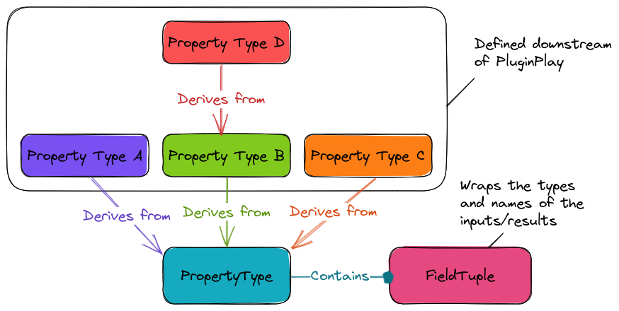

.. Copyright 2023 NWChemEx-Project
..
.. Licensed under the Apache License, Version 2.0 (the "License");
.. you may not use this file except in compliance with the License.
.. You may obtain a copy of the License at
..
.. http://www.apache.org/licenses/LICENSE-2.0
..
.. Unless required by applicable law or agreed to in writing, software
.. distributed under the License is distributed on an "AS IS" BASIS,
.. WITHOUT WARRANTIES OR CONDITIONS OF ANY KIND, either express or implied.
.. See the License for the specific language governing permissions and
.. limitations under the License.

.. _property_type_design:

#####################################
Designing the Property Type Component
#####################################

:ref:`call_graph_design` calls for a property type component. This section
outlines the design decisions that went into that component.

************************************
What is the Property Type Component?
************************************

At the lowest level all modules have the same :ref:`api`: take a series of
type-erased inputs and return a set of type-erased outputs. In strongly typed
languages like C++, type-erased objects are cumbersome to work with. The
property type component facilitates the wrapping/unwrapping of
typed/type-erased objects while also enforcing a standardized :ref:`api`.

****************************
Property Type Considerations
****************************

From :ref:`call_graph_design` we have:

#. Dynamic determine module :ref:`api`

   - Property types will need to wrap/unwrap typed/type-erased data

#. Domain agnostic

   - PluginPlay needs to avoid coupling to the domain-specific types

While not explicitly called for at this point we also want:

3. Avoid exposing templates to the user (to the extent possible)

   - Property types will inevitably use templates, but many C++ programmers in
     computational science are not comfortable with advanced template usage.

#. Use property types to factor out input/result provenance

   - The same property type will be used by multiple modules. Rather than
     duplicating provenance, particularly input/result descriptions, in each
     module, we want to factor this out to the property type.

#. Allow property type inheritance

   - Many properties are related via "is-a-type-of" relationships.
   - Inheritance captures "is-a-type-of" relationships and can be used for
     avoiding duplication

******************************
Property Type Component Design
******************************

.. _fig_property_type_design:



   Architecture of the property type component. Users derive from the
   ``PropertyType`` class to implement their property types. The template
   meta-programming needed for dealing with types is factored out into the
   ``FieldTuple`` class.

Fig :numref:`fig_property_type_design` shows the architecture of the property
type component. The ``PropertyType`` class holds the bulk of the implementation.
Users derive their property types from ``PropertyType``, using the curiously-
recursive template pattern (CRTP). CRTP facilitates PluginPlay implementing
features on behalf of the user, without PluginPlay knowing the types. *N.B.*,
normal inheritance would not allow the ``PropertyType`` class to access the
types defined in the derived class. In our implementation ``PropertyType`` is
templated on the derived type and the base type(s). The ``PropertyType`` class
will implement four functions ``wrap_inputs``, ``wrap_results``,
``unwrap_inputs``, and ``unwrap_results`` which can be used to type-erase and
un-type-erase data on behalf of the user.

In the derived class, users fill in two ``FieldTuple`` objects, one for the
inputs and one for the results. The process of doing this is wrapped by
"virtual" functions (since we're using CRTP they're not actually virtual)
``inputs_`` and ``results_`` respectively. The ``FieldTuple`` objects are
responsible for storing not only the types of the inputs, but also the default
values, descriptions, etc. It is the responsibility of the ``FieldTuple``
objects to define as simple of an :ref:`api` as possible.

Python Property Types
=====================

Property types defined in C++ can be used in Python so long as the types in the
interface are registered with pybind11. Some users will want to
define their property types in Python though. In such case sthe inputs/results
are Python types and will not be visible to C++ (without some sort of
registration system).

We propose to develop a class ``PythonOnlyPropertyType`` that defines the base
API for property types written in Python. Python property types are then
implemented by deriving from ``PythonOnlyPropertyType``. Use of the property
type API is envisioned as working like:

.. code-block:: python

   class MyPythonModule(pp.ModuleBase):
         def __init__(self):
            super().__init__(self)
            self.satisfies_property_type(MyPythonPropertyType())

         def run_(self, inputs, submods):
            [inp0, inp1, inp2] = MyPythonPropertyType.unwrap_inputs(inputs)

            # Do work with inp0, inp1, inp2

            rv = self.results()
            return MyPythonPropertyType.wrap_results(rv, res0, res1, res2)

The definition of the property type would look like:

.. code-block:: python

   class MyPythonPropertyType(pp.PythonOnlyPropertyType):
         def __init__(self):
            self.declare_inputs("inp0").set_description("Input 0 description")
            self.declare_inputs("inp1").set_description("Input 1 description")
            self.declare_inputs("inp2").set_description("Input 2 description")

            self.declare_results("res0").set_description("Result 0 description")
            self.declare_results("res1").set_description("Result 1 description")
            self.declare_results("res2").set_description("Result 2 description")

The property type would be responsible for knowing how many inputs/results there
are and the descriptions of each. Consistent with typical Python usage, the
property type should allow duck typing. The latter means that the property type
can not be used from C++ without some sort of type registration system.


Summary
=======

Our design addresses the above considerations by:

#. Dynamic determine module :ref:`api`

   - ``unwrap_inputs`` / ``unwrap_results`` and
     ``wrap_inputs`` / ``wrap_results`` functions can be used at runtime to go
     from/to type-erased inputs/results.

#. Domain agnostic

   - CRTP allows the ``PropertyType`` class to access derived class's types
     through "inheritance".
   - Derived classes, and their types, live in downstream code.

#. Avoid exposing templates to the user (to the extent possible)

   - Largely falls to ``FieldTuple`` component.
   - Macros further de-template the :ref:`api`.

#. Use property types to factor out input/result provenance

   - ``FieldTuple``` stores provenance for inputs/results.
   - Can be overridden on a per-module basis.

#. Allow property type inheritance

   - ``PropertyType`` is templated on base property types.
