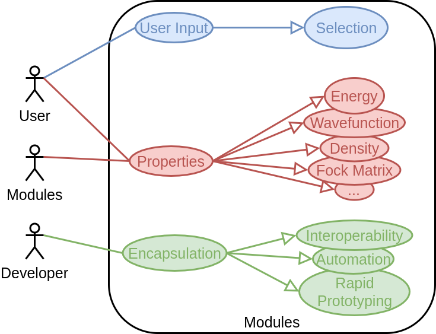

@page module_api_considerations Module API Considerations

[TOC]

The purpose of the current page is to describe the considerations that went into
the API of the Module class and the associated helper classes.

@section module_api_use_cases Use Cases and Considerations

Modules are envisioned as being the building blocks of a program that utilizes
the SDE framework.  The following use case diagram details the primary users of
modules as well as the primary use cases.



The use cases are described in more detail in the following subsections. 
Based on the use cases we ultimately conclude that when designing our API we 
should keep in mind:

- Modules can be made from lambdas and functions
- Add properties without modifying existing modules or the SDE
- Parallel usage can not be an afterthought
    - Runtime needs to be propagated to modules
    - All input via module API (no global state)
- API will vary with computed properties and algorithms used
- Module API should be decoupled from SDE
- Module API should be amenable to memoization
- Module API should be wrappable in Python

@subsection module_api_user_input User Input

Although not the primary purpose of modules, user input is the simplest use case
and we discuss it first.  Generally speaking this use case amounts to providing 
a means for the user to provide very specific input to a module, when specifying
said input is not necessarily straightforward.  One particularly relevant 
example is selecting elements of a set (*e.g.* choosing atoms, molecules, or MOs 
from the system).  In this example a module is provided a set and it needs to 
partition that set in some manner.  For a set comprised of @f$ N @f$ elements
there are @f$ S(N, k) @f$ possible ways to partition the set into @f$ k @f$ 
subsets (@f$ S(N, k) @f$ being the Sterling number of the second kind). Given 
the rapid growth of @f$ S(N, k) @f$ with @f$ N @f$ it is impractical to expect 
the module to explicitly allow all possible choices.  Instead, a module may 
implicitly allow all possible choices by simply asking the user which partition 
they want. 

Admittedly allowing the user to partition a set is not novel for most 
computational chemistry packages.  In existing packages, this partitioning is 
done by establishing an order (*e.g.* the order the user listed the atoms or the 
energetic ordering of the MOs) and then asking the user to provide @f$ k @f$ 
lists of integers, where the presence of an integer in a list means that the 
corresponding element is included in that set.  This is tedious and error-prone.  
Using modules, a more natural way to solicit this feedback is:

```.cpp
//Inside the module (example is NOT actual syntax, but representitive)

std::set<Atom> the_set; // Example set for user to partition

auto user_input_module = // Somehow get the module providing user's input

std::set<Atom> set1, set2; // These will be the resulting partitioned sets

std::tie(set1, set2) = user_input_module(the_set); // Call the module

//Do stuff with partitioned sets
```   

Note that in this example the user is provided the actual set and is free to
actually use an algorithm in their module to determine what elements go into
which set.  Furthermore by working with the actual quantities, it is possible to
make dynamic choices (say based on distance) and even to sometimes skip 
preliminary calculations (*e.g.* for making MO selections).

As for this use case's implications on the API design it largely boils down to
needing a simple API to streamline the user's interactions.  Arguably the 
simplest callable object is a function or a lambda and thus it suffices to 
ensure that it is possible to make a module simply by providing any callable 
object.  That said, under the hood we will end up wrapping such callable objects
in adaptor classes to satisfy the more general module API motivated by the 
remaining use cases.

@subsection module_api_properties Properties

Arguably the most important use case of modules is to compute properties.  We
intentionally leave the definition of properties vague to avoid excluding 
possible future properties and instead opt for the somewhat circular definition:
a "property" is something computed by a module.  Examples of properties include 
quantities of interest to the user like: energies, MOs, densities, *etc.*, as 
well as quantities that are primarily of use to developers like: Fock matrices, 
integrals, *etc.*.  As it is difficult to enumerate all possible properties that
a user/developer may want to compute we will require that the SDE and module 
APIs continue to work if additional properties are added at a later time.

We anticipate the vast majority of computational time being spent computing 
properties.  For this reason it is essential that it is possible to compute 
properties in parallel.  This has two main consequences on the module API: a 
module must be given the current parallel runtime and a module must obtain all
data necessary to compute the property via its API.  The latter notably 
excludes modules from getting their information from a global state (the 
usage of which is a notorious problem for parallel programs).  A direct 
corollary to this is that the module API will differ not only with each 
property, but also with each algorithm used to compute to those properties. 


@subsection module_api_encapsulation Encapsulation

So far we have described modules in a largely opaque manner.  In fact assuming
that modules are fully encapsulated leads to a number of use cases, automation, 
interoperability, and rapid prototyping, which are only feasible if this is the
case.  Ultimately, this opaqueness requires that modules that compute the same
properties be interchangable.  To a large extent this requirement is taken care
of by requiring modules that compute the same property to have the same API; 
however, there is a more subtle requirement in that it also requires a module to
run the same way each time it is invoked on account of the fact that it will be
given the same input each time.

The latter point leaves the module with no recourse, but to recompute a result
each time it is invoked.  Given the expected cost of many of the modules to be 
used with the SDE we require a means of amortizing the cost of subsequent calls.  
To this end we intend to use memoization.  Memoization is a standard computer 
science technique whereby a function's result is cached so that subsequent calls
to that function (with the same input) simply return the cached result.  This 
additionally imposes that the API must be amenable to memoization (care must 
be taken when passing objects whose state is determined by floating point 
values). 

Although not strictly a requirement of encapsulation, we note that many of the
use cases of encapsulation are things developers currently use Python for.  To
this end it will also behoove us to choose a module API that is wrappable in
Python.  Notably this requires that all APIs exposed to Python are not templated
or, if they are templated, they must be restricted to a set of known 
instantiations.  This is because templating requires types to be known at 
compile time, whereas Python requires types to be evaluated at run time.

@section module_api_parts Parts of the Module API

The previous section established the design parameters influencing the module
API.  This section delegates the responsibility for these design parameters to a
series of classes.

As mentioned above 


Example Use Cases
-----------------

### Single Point

The simplest use-case is a single-point (*i.e.* the computation of the energy
of a molecular system at a particular geometry).  Using the SDE this looks like:

```.cpp
//Make an empty SDE instance
SDE sde;

//Assume that functor is a functor implementing the module API for the method that
//will compute the energy and info is its ModuleInfo instance
sde.play.add_module("NWX", "SCF", "SCF", functor, info);

//Note steps up to here would be typically handled by initialize function

//User creates a molecule somehow
auto sys = fxn_that_makes_molecule();

//Run the computation
auto result = sde.run("SCF", sys);

//Assume energy is under key "Energy"
auto opt_egy = result.at<double>("Energy");
```
 
### Geometry Optimizer

This use-case illustrates what it looks like when modules are nested.  In a 
geometry optimization we are given a molecular system. We then attempt 
to find the configuration (*i.e.* atom placement) of that system that has the
smallest energy as computed by a particular method.

For our The top-level program would look something like this:

```.cpp
//Make an empty SDE instance
SDE sde;

//Assume that functor is a functor implementing the module API for an optimizer
//and that info is the ModuleInfo instance for it
sde.play.add_module("NWX", "Optimizer", "Optimizer", functor, info);

//Similar assumptions here, except now for the method that will compute the 
//gradient and energy
sde.play.add_module("NWX", "SCF", "SCF", scf_functor, scf_info);

//The derivative order is a parameter so copy the module and change value
sde.play.copy_module("SCF", "dSCF/dX");
sde.play.change_option("dSCF/dx", "deriv", 1);

//Note steps up to here would be typically handled by initialize function

//User creates a molecule somehow
auto sys = fxn_that_makes_molecule();

//Run the optimization (see below for sample optimizer code and param 
//explanation)
auto result = sde.run("Optimizer", sys, Parameters{"Function", "SCF",
                                                   "Gradient", "dSCF/dX"});

//Assume the optimized molecule is returned under the key "System"
auto opt_sys = result.at<LibChemist::System>("System");

//Assume energy is under key "Energy"
auto opt_egy = result.at<double>("Energy");
```

Glossing over the details of how to optimize, the implementation of our module may
look something like:

```.cpp
struct Optimizer {
    ResultMap operator()(SDE& sde, const LibChemist::System& sys, 
                         const Parameters& params) {
                         
        //As part of our module's ModuleInfo instance we specified that "Function" and
        //"Gradient" respectively be set to the keys of modules that can compute
        //the value of our function and it's gradient (when given the system)
                                              
        auto egy_key = params.at<std::string>("Function");
        auto grad_key = params.at<std::string>("Gradient");
        
        System new_sys{sys};
        bool converged = false;
        while (!converged) {                                                 
            auto egy = sde.run(egy_key, new_sys);
            auto grad = sde.run(grad_key, new_sys);
        
            //Use egy and gradient to compute new system
            new_sys = update_system(new_sys, egy, grad);
            
            //Determine if converged
            converged = check_convergence(new_sys, egy, grad);            
        }; 
    }
};
```
