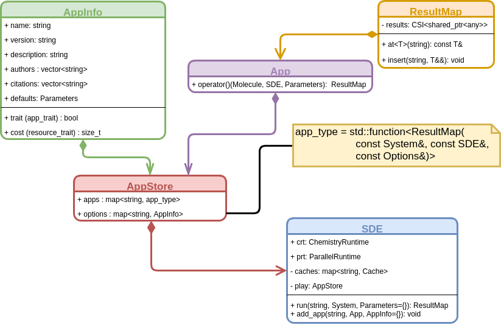

Advanced App Flow
=================

The page [App Flow](@ref md_dox_AppFlow) illustrated the basics of an app's 
lifecycle.  This page covers all of the gritty details.  The following UML 
diagram shows all relevant parts of the SDE having to do with the app lifecycle.



Step 1: App Creation
--------------------

For the most part coding an app up is as simple as detailed on the page 
[App Flow](@ref md_dox_AppFlow).  What we skipped on that page is the large 
amount of metadata that an app developer can attach to their app.  The class 
responsible for this is AppInfo and full details can be found 
[here](dox/AppInfoAPI.md).  The SDE is designed so that apps can run without 
an `AppInfo` instance; however, the resulting app provides the user no means 
of changing its parameters and its run may be sub-optimal from a performance 
standpoint.  As added incentive for developers to do a good job filling out 
`AppInfo` the SDE provides (well it will provide) functions which take an SDE 
instance, loaded with all the apps in their default states, and generates 
markdown documentation suitable for inclusion with Doxygen.

Step 2: AppStore Creation
-------------------------

Step 2 of [App Flow](dox/AppFlow.md) hid a lot of complexity.  Generally 
speaking there are a lot of ways to fill an `AppStore` instance.  The full 
signature of the `add_app` command is:

```.cpp
void add_app(const std::string& super_app_name, 
             const std::string& app_name, 
             const std::strin& app_key, 
             T&& app, 
             const AppInfo& info);
```

For the most part apps will be added to the app store using this full syntax. 
The arguments to which are:

- `super_app_name` essentially the namespace to place the app within
- `app_name` this is the name for the "concept of the" app.  Basically in an 
  object-oriented analogy it's the equivalent of a class.  
- `app_key` completing the analogy this is the equivalent of an instance of a
  class.  
- `app` same as in the basic case, this is the actual callable to use
- `info` this is the `AppInfo` instance defining the parameters and meta-data
  for the app.  

For completeness it's perhaps worth indicating that the shortened version we 
showed you previously maps to:
```.cpp
void add_app(const std::string& app_key, T&& app) {
    add_app(app_key, app_key, app_key, app, info);
}
```
and is typically fine for when one wants to write a one-off app, like our 
simple hello world app.  Basically it defines an app with no meta-data, that 
takes no parameters, and assigns it as the only app in its own namespace.  
For all intents and purposes apps created in this manner are basically 
singletons.

For convenience a superapp may define a function like:

```.cpp
AppStore superapp_initialize() {
   AppStore rv;
   rv.add_app(...);
   rv.add_app(...);
   ...
   return rv;
}
```

which creates an AppStore instance and fills it with the apps available in 
the superapp.  If the superapp is loaded at runtime *via*:
 
```.cpp
sde.load_superapp("path/to/superapp.so");
``` 

`dlopen` will be used to find and invoke this function (typically this 
would be invoked from Python so that the paths can be set at runtime 
and thus allow the superapp to function like a plugin).  Otherwise, if 
traditional linking is desired the AppStore instance resulting from manually 
calling the function can be passed to `load_superapp`:

```.cpp
    sde.load_superapp(superapp_initialize());
```  

Step 3: Running An App
----------------------

For the most part running an app really is as simple from the user-perspective
as depicted on the simple [App Flow](dox/AppFlow.md) page.  What we really 
glossed over there are the full details of the innards of the `run` command. 
The full details of the `run` command are covered [here](dox/RunningAnApp.md), 
for the purposes of this page it is worth noting that `SDE::run` is 
essentially a memoized run of `SDE::AppStore::run`.  What this means is that 
when you call `SDE::run` the SDE will first determine if it has computed the 
result before.  If it has, it simply returns it.  If not it invokes 
`AppStore::run`, saves the result, and returns it.  Memoized results are 
saved in the cache, details of which are (link to page).

Step 4: Deleting An App
-----------------------

This step proceeds exactly as described in [App Flow](dox/AppFlow.md).  Given
the more complete description detailed here it's worth stating a few 
additional points:

1. An app's state is not stored.
   - If an app computes an expensive intermediate it should be the result of a
     subapp call.
2. All parallel resources given to the app will be released back to the program
   - Apps should not assume that they will be given the same parallel resources
     on each invocation
        
