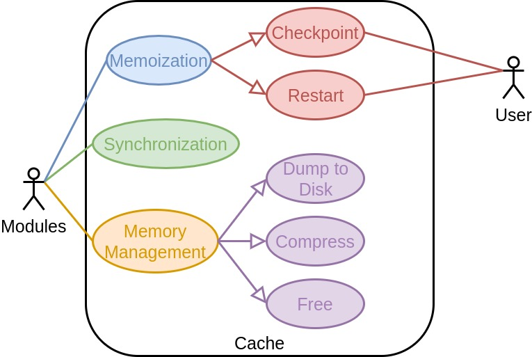
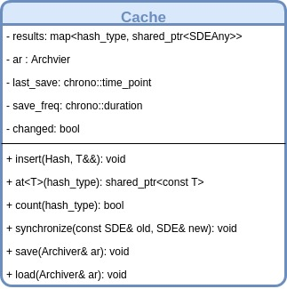

@page cache_api Cache API

[TOC]

The current page focuses on the the design decisions behind the Cache object.
For the most part the design of the Cache object was driven by the 
[Module API](@ref module_api) and the [Module Manager API](@ref mm_api).

@section cache_api_use_cases

The following use case diagram shows the intended uses of the Cache as well as
who those use cases are primarily targeted at.

For the most part the use cases for the Cache are straightforward.  We want to
be able to checkpoint the program's state and reload it if something goes wrong.
Additionally, we want a means to archive (long-term storage) the results of a 
computation, specifically in a manner that does not sacrifice context or 
precision.  Given the focus on parallel computing, it will be necessary over 
the course of a calculation to synchronize results stored on a superset or 
subset of processes.  The Cache must be able to do this in a somewhat automatic
fashion.  Finally, since the Cache will be the largest consumer of memory it is
essential that the Cache have some routines for reducing its memory footprint.

@section cache_api_options Purposed Cache API

Ultimately the Cache is little more than a hash map holding the state of a 
particular module type.  Synchronization, serialization, *etc.* are 
ultimately implemented by the SDEAny class and at the Cache level amount to 
looping over entries.  That said, the following UML diagram illustrates our
purposed Cache API.

For the most part it is similar to the `std::map` class aside from the fact that
its `at` member is templated.  Perhaps the notable difference is the 
machinery to enable automatic saving.  More specifically, when `insert` is 
called, the time since the last save is compared to the requested save 
duration.  If the time passed is longer than the requested duration the cache is
saved.  Each cache instance will ensure this write is done in a thread-safe 
manner.  It is the responsibility of the Archiver to ensure that the saves do
not clobber each other when more than one type of module tries to save in a 
threaded context or if multiple processes try to write simultaneously.
  
