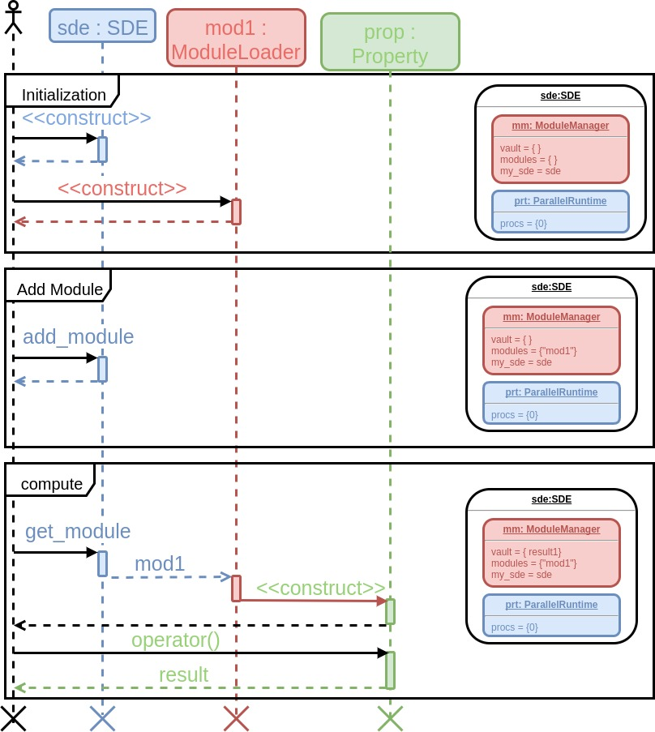
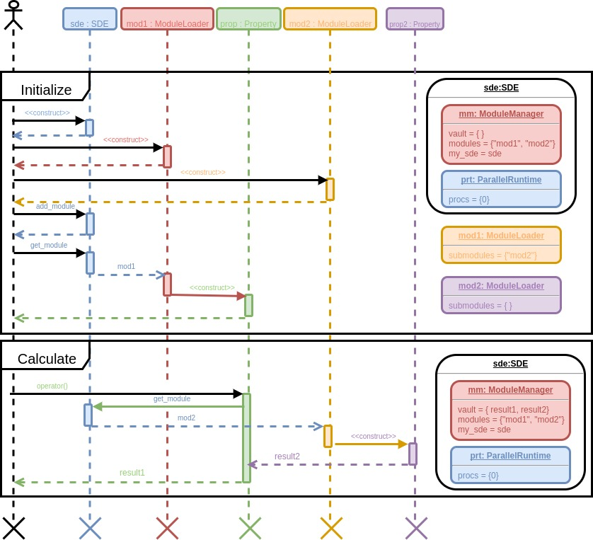
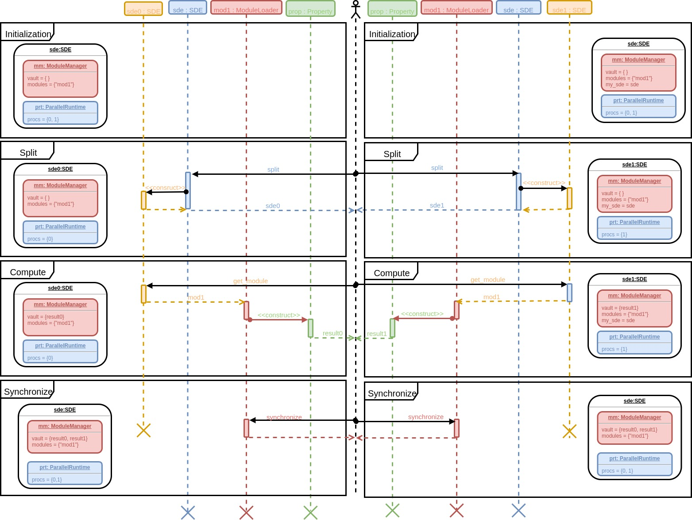

@page control_flow  Control Flow Within the SDE

[TOC]

The purpose of this page is to work through typical control flow scenarios 
encountered in the SDE.  To this end we, like the SDE, will treat the modules as
opaque objects.  Without loss of generality, we assume that all modules are the
same type (for concreteness the reader may think of them as modules that compute
energies).  Associated with our module is some property, which we simply call
 `Property`.

@section control_flow_serial Serial Execution

This section focuses on the state of the SDE during serial execution.

@subsection control_flow_serial_mod1 Single Module

Ignoring the trivial workflow where no modules are called the simplest workflow
possible is to call a single module.  This is depicted in the following UML
diagram.



In terms of C++ this looks something like:

```.cpp
// Initialization
SDE sde;
ModuleLoader mod1;

// Add module
sde.add_module("mod1", mod1);

// compute
Property prop(sde.get_module("mod1"));
auto result = prop(...); // ellipses are whatever arguments prop needs to run 
```

We are particularly interested in the state of the SDE after every series of 
operations and thus on the right side explicitly show it.  

The first is to initialize the relevant objects.  In a normal run, and in line 
with typical C++ practices the objects would likely be initialized closer to 
their usage sites, but the UML diagram is significantly cleaner if all 
initialization is up front.  After initialization we add the module to the 
SDE.  Finally, we compute the module's property.  The result is returned to the
user who can then do what they please with it.  By default when the SDE instance
goes out of scope the results will be archived to disk.

@subsection control_flow_serial_mod2 Nested Modules

The next most complicated scenario is when a module calls another module.  The
following UML diagram describes the control flow through the SDE.



The corresponding C++ code is nearly identical.
```.cpp
// Initialization
SDE sde;
ModuleLoader mod1;
ModuleLoader mod2;
// add "mod2" as "mod1" submodule

// Add modules
sde.add_module("mod1", mod1);
sde.add_module("mod2", mod2);

// compute
Property prop(sde.get_module("mod1"));
auto result = prop(...); // ellipses are whatever arguments prop needs to run 
```

The first several steps are identical to the single module case aside from the
fact that `"mod1"` now lists `"mod2"` as a submodule and that we have to 
additionally add `"mod2"` to the SDE instance.  Externally the call to `prop()`
remains the same, while internally the compute process is repeated again.  First
we make a Property instance given `"mod2"`.  Then we call that instance.  
Finally `"mod1"` uses the result of `"mod2"` to compute its own result and 
returns it.  It should be obvious that additional module nestings lead to no 
additional complications.

@section control_flow_procs Multiprocess SDE Execution

Ultimately threading over SDE calls does little to change how control flows
through the SDE, aside from requiring operations to be thread-safe.  For this
reason we next turn our attention to multiprocess parallelization.  For 
simplicity we assume the user does the parallelization calls manually; however,
much of what is described in the following can actually be done automatically by
the SDE (via the same mechanisms, except that the SDE plays the role of the 
user).  We will assume the reader is familiar with [Parallelization Within 
the SDE](@ref parallelization) for this section.

The following diagram depicts a parallel run of the SDE on two processes.
  

  
Not shown are the initialization steps as they are identical to the steps from
the previous sections with the exception that the ParallelRuntime instance is 
initialized with two processes.  After initialization we decide we are going to
run `"mod1"` with two different inputs (one input per process).  To do this we
first split the SDE.  This gives us two new SDE instances which we call 
`sde0` on process 0 and `sde1` on process 1.  Each process then uses its new
SDE instance to run the module.  The result obtained on process 0 is called 
`result0` and the result obtained on process 1 is called `result1`.  As the 
diagram makes clear the caches are different on each process after the compute
step.  Per our parallelization assumptions, we next synchronize the two Cache
instances so that the results are available on each process. 

Although it may not be obvious, adding more processes does not add any 
additional complexity to this diagram (aside from there are more things to
synchronize).  Similarly, nesting multiprocess parallelization adds little new
complexity as the above diagram is simply replicated within the nested context.
