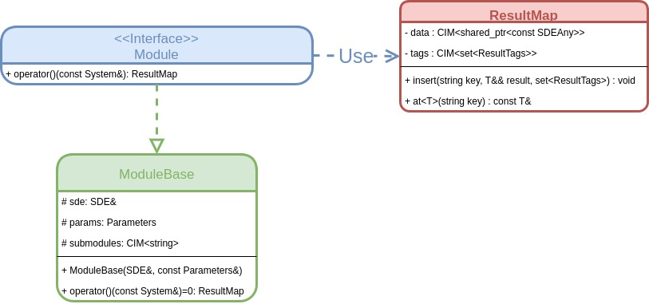
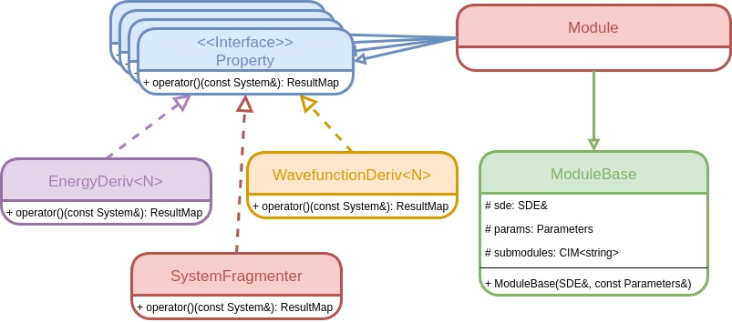
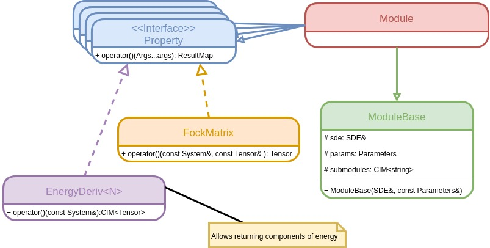
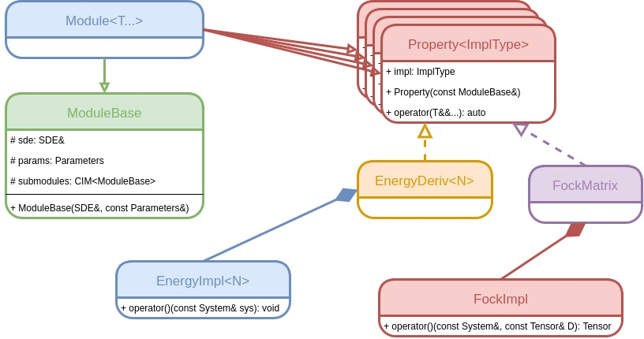

@page module_api Module API Considerations

[TOC]

The purpose of the current page is to describe the considerations that went into
the API of the Module class and the associated helper classes.

@section module_api_use_cases Use Cases and Considerations

Modules are envisioned as being the building blocks of a program that utilizes
the SDE framework.  The following use case diagram details the primary users of
modules as well as the primary use cases.


The use cases are described in more detail in the following subsections. 
Based on the use cases we ultimately conclude that when designing our API we 
should keep in mind:

- Add properties without modifying existing modules or the SDE
- API should not inhibit parallelization
- All input/output to a module should be explicit
- Modules can be made from lambdas and functions 
- API must be generic for each property
- API must be standardized per property
- Module API should be amenable to memoization
- Must be possible to associate with each module metadata

@subsection module_api_properties Properties

Arguably the most important use case of modules is to compute properties.  We
intentionally leave the definition of properties vague to avoid excluding 
possible future properties and instead opt for the somewhat circular definition:
a "property" is something computed by a module.  Examples of properties include 
quantities of interest to the user like: energies, MOs, densities, *etc.*, as 
well as quantities that are primarily of use to developers like: Fock matrices, 
integrals, *etc.*.  

In terms of API consequences, we note that it is difficult to enumerate *a 
priori* all possible computable properties.  This implies that the SDE must be
extensible in terms of what properties it supports.  Furthermore, addition of a
new property should not require modifications to the SDE library itself.  
Conversely, we also do not want modifications to the SDE to break support for
existing modules.  This requires that the implementation of a property be 
decoupled from the list of properties.  Actually computing a property is likely 
to be the bottleneck in most uses of the SDE.  It is thus also essential that 
developers are able to parallelize the computation of properties without the SDE
getting in the way.  Where possible, the SDE should facilitate this process. 
Parallelization is by far easier if all input/output to a function is explicit 
in the function's signature (*i.e.* no global variables).  Thus we additionally
require that all input/output is explicit in the module API.

@subsection module_api_user_input User Input

Generally speaking this use case amounts to providing a means for the user to 
provide very specific input to a module, particularly when specifying said input
is not necessarily straightforward.  One relevant example of such a scenario is 
selecting elements of a set (*e.g.* choosing atoms, molecules, or MOs).  In this
example a module is provided a set and it needs to return the partitioned set.  
For a set comprised of @f$ N @f$ elements there are @f$ S(N, k) @f$ possible 
ways to partition the set into @f$ k @f$ subsets (@f$ S(N, k) @f$ being the 
Sterling number of the second kind). Given the rapid growth of @f$ S(N, k) @f$ 
with @f$ N @f$ it is impractical to expect the module to explicitly allow all 
possible choices.  Instead, a module may implicitly allow all possible choices 
by simply asking the user to provide. 

Admittedly allowing the user to partition a set is not novel for most 
computational chemistry packages.  What is novel about our implementation is 
allowing it to be done by callbacks.  In contrast, most existing packages allow
the user to specify the partitionings by establishing an order (*e.g.* the order
the user listed the atoms or the energetic ordering of the MOs) and then asking 
the user to provide @f$ k @f$ lists of integers, where the presence of an 
integer in a list means that the corresponding element is included in that set.  
This is tedious and error-prone.  Modules are a more natural way to solicit this
feedback as shown here:

```.cpp
//Inside the module (example is NOT actual syntax, but representitive)

std::set<Atom> the_set; // Example set for user to partition

auto user_input_module = // Somehow get the module providing user's input

std::set<Atom> set1, set2; // These will be the resulting partitioned sets

std::tie(set1, set2) = user_input_module(the_set); // Call the module

//Do stuff with partitioned sets
```   

Note that in this example the user is provided the actual set and is free to
examine the elements in order to determine what elements go into which set.  
Furthermore by working with the actual quantities, it is possible to make 
dynamic choices (say based on distance) and even to sometimes skip preliminary 
calculations (*e.g.* for making MO selections).

As for this use case's implications on the API design it largely boils down to
needing a simple API to streamline the user's interactions.  Arguably the 
simplest callable object is a function or a lambda and thus it suffices to 
ensure that it is possible to make a module simply by providing any callable 
object.  That said most of the recommended APIs require more than simply having
a callable object so the use of adaptor classes for callables will prove 
essential.

@subsection module_api_encapsulation Encapsulation

The motivation for the encapsulation use case is module composability.  A bit
more specific, we note that a large amount of research has gone into stitching
existing methods together in some manner.  Examples include multiscale methods 
(QM/MM, ONIOM, *etc.*), geometry optimizations, and basis set extrapolation 
techniques.  Given the age of most computational chemistry packages, composing 
methods was an afterthought.  The result is that composite methods are usually 
implemented as a hack or by external scripts. Either way, because the resulting
method is not fully connected into the package, the method can usually only be 
accessed in a limited capacity (for example despite most *ab initio* packages
having geometry optimization capabilities and QM/MM techniques few packages are 
capable of optimizing on the QM/MM surface directly).  The SDE aims to change 
this by ensuring composite methods are treated as first class modules and thus
can utilize all resources available to their non-composite brethren.

Ultimately the keys to composability are encapsulation and uniformity.  In this
context these two points really boil down to requiring modules to be relatively
self-sufficient, *i.e.* a module must be able to compute its result without 
outside intervention (aside from the input it was given).  What makes this 
tricky is that just because two modules are capable of computing, say, an energy
doesn't mean their algorithms require the same input to do so.  Generally 
speaking, this means a module will be given the lowest common denominator of 
the input needed for a particular property and will have to compute all other 
required input itself.  The most logical way to compute the additional input is 
by exploiting composability, *i.e.* by calling other modules.  For efficiency
purposes it then becomes essential that modules have a means to "cache" 
results (otherwise repeated calls to a module imply repeated computation).
    
Encapsulation leads to a number of additional use cases including:
- automation. SDE is able to treat modules as black-boxes to perform tasks for
  the developer/user including checkpoint/restart and coarse-grained parallelism
- interoperability.  Existing self-contained libraries can easily be ported to
  the SDE via simple wrapper APIs.  Similarly calling modules from outside the
  SDE should be relatively straightforward. 
- rapid prototyping.  It is possible to tweak/extend existing algorithms by
  wrapping them. 
    
As for API implications, encapsulation largely means we need to standardize the
APIs we use and that we ensure the resulting APIs are amenable to memoization.
The additional use cases are facilitated by associating with each module some
additional meta data (such as whether it's thread safe and its estimated cost).


@section module_api_parts Module API Options

The previous section established the design parameters influencing the module
API.  This section explores several possible Module APIs. To that end we assume
a few things:

- Modules are decoupled from their state
  - Providing modules persistent state means caller has to be concerned with 
    memory semantics (want to avoid this)
  - Automate checkpoint/restart is easier without an opaque object in the way
  - Parameters can be fowarded to submodules without having to go through the
    caller (they get registered with the SDE who then directly gives them to the
    submodule)
- Parameters to a module are largely algorithmic in nature
  - Thresholds, number of iterations, *etc.*
  - Set by user initially and then provided to module by SDE not caller
- Modules are called by using the overloaded `operator()` member
- Each module instance is assigned to a module key (a unique string descriptor)
  - Allows multiple algorithms/modules to be registered per property

This section is meant to focus on the module APIs and not so much on how the
modules interact with other classes outside the hierarchy.  Thus the code in 
this section should be considered representative of how other classes may 
interact with the purposed APIs and not as the actual code one would write.
   

@subsection module_api_c_like C-Like API

The first purposed API attempts to achieve maximum flexibility while allowing
functors, functions, and lambdas to be used directly as modules.


In this design the APIs for all properties have been reduced to the lowest 
common denominator: the SDE instance to use to call other modules and the 
molecular system of interest. Results are returned in an associative container
where the key is a string describing what the result is and the value is a 
shared pointer to the type-erased value.  Associated with each return value is a
list of (for now opaque) tags meant to facilitate the automation of the value's 
lifetime.  Metadata describing the module is managed by (the not shown) 
ModuleInfo class, an instance of which is stored in the SDE.  Since for all 
intents and purposes the SDE holds the state of the module one can think of this
API as being somewhat C-like (since structs in C can't have member functions one
typically defines member functions as free functions that explicitly take the 
struct, roughly analogous to the present API).

This API has the benefit that it makes writing very generic algorithms, like a 
geometry optimizer, easy:

```.cpp
SDE sde; // SDE instance we were given
System sys; // system we want to optimize
string key = // module key for module providing energy & gradient

bool converged = false;
do {
    auto derivs = sde.run(key, sys);
    auto egy = derivs.at<double>("Energy");
    auto grad = derivs.at<Tensor>("Gradient");
    auto new_sys = update_system(sys, egy, grad);
     
    sys = new_sys;
} while(!converged);
```

However, the syntax is slightly awkward when used with iterative methods like an
SCF:

```.cpp
// We ignore checking the energy and what keys would be called to get density

SDE sde; // SDE instance we were given
System sys; // system we were provided
bool converged = false;

do {
    // Key for building the Fock matrix (calls a density builder)
    std::string f_key = sde.get_submodule("Fock Builder");
    
    // Key for building the density (calls a Fock builder)
    std::string d_key = sde.get_submodule("Density Builder");

    // Compute density using current top level of recursion
    auto D = sde.run(d_key, sys);
    
    converged = // check if converged
    
    //Copy F, make it call the module set to d_key
    f_key = sde.copy(f_key);
    sde.change_submodule(f_key, "Density Builder", d_key);

    //Copy D, make it call new Fock builder
    d_key = sde.copy(d_key);
    sde.change_submodule(d_key, "Fock Builder", f_key); 
          
}while(!converged)
```

Basically we have to dynamically construct a recursion tree until its depth is
deep enough that the returned density is converged.  At a depth @f$n@f$, the 
tree relies on memoization to avoid recomputing the @f$n-1@f$-th result 
(results deeper than @f$n-1@f$ could be freed without affecting the 
memoization). 

| Pros                              |                                Cons |
| --------------------------------- | ----------------------------------- |
| 1. All callables directly usable. | 1. Type checks are done at runtime  |
| 2. All property calls identical.  | 2. Properties checked at runtime    |
| 3. Easy to add more properties    | 3. Easy to call wrong property      |   
| 4. Easy to memoize                | 4. Awkward syntax for iteration     |
|                                   | 5. Templating complicates Python    |


@subsection module_api_functional Functional-Like API

The previous API was in a certain light C-like.  In order to make the API more
C++-like we can introduce a class ModuleBase, which holds the current state of
the module.



In addition to moving the SDE and Parameters instance to the base class, we have 
also included the list of submodules to be called (in the C-like API this would 
also exist, but owing to the module not being able to store state it would have
to reside in the SDE somewhere).  Aside from these two small modifications the 
functional-like API is nearly identical to the C-like API and thus has nearly 
the same pros and cons: 

| Pros                              |                                Cons |
| --------------------------------- | ----------------------------------- |
| 1. All property calls identical.  | 1. Callables require adaptor        |   
| 2. Easy to add more properties    | 2. Type checks are done at runtime  |
| 3. Easy to memoize                | 3. Properties checked at runtime    |
| 4. More object-oriented           | 4. Easy to call wrong property      |   
|                                   | 5. Awkward syntax for iteration     |
|                                   | 6. Templating complicates Python    |

@subsection module_api_strong_type_props Strong Type Properties

The previous two APIs used a common module type for every property.  This makes
it easy to, for example, accidentally call a module that computes an energy
instead of one that partitions the system.  The goal of the present API is to 
guard against such erroneous module calls by making the type of the module 
reflect the property that is capable of computing.  Thus the types of the 
modules now play a role akin to the C++ concept of strong types.



This API ultimately works by multiple inheritance.  Specifically each module 
inherits from the ModuleBase class as well as the classes for each property the
module can compute.  For example, based on the properties available in the above 
UML diagram, if your module could compute both an energy and a wavefunction then 
you would declare your module something like:

```.cpp
class MyModule: public ModuleBase, EnergyDeriv<0>, WavefunctionDeriv<0> {
   // class defintion
 };
```

Additional properties could be added simply by writing additional classes (the
actual definitions of which would not need to be included in the SDE library).
When it comes time to compute a property the SDE would side cast to the appropriate
base class (throwing a runtime error if the module doesn't derive from it) and then 
invoke the resulting module.  Hence compared to the previous two APIs the big code
difference is that calls to the SDE require the type of the property we want 
to compute.  For example the geometry optimization would now look like:

```.cpp
SDE sde; // SDE instance we were given
System sys; // system we want to optimize
string key = // module key for module providing energy & gradient

bool converged = false;
do {
    // We assume that the gradient call also returns the energy
    auto derivs = sde.run<EnergyDeriv<1>>(key, sys);
    auto egy = derivs.at<double>("Energy");
    auto grad = derivs.at<Tensor>("Gradient");
    auto new_sys = update_system(sys, egy, grad);
     
    sys = new_sys;
} while(!converged);
```

The simple geometry optimization example shows the main gotcha of this API, 
namely one needs to take care to ensure all intermediate properties are 
memoized.  For example, consider a code that computes the SCF gradient given
only the molecular system.  Such a module will in general also be capable of
computing the wavefunction, the energy, and the energy gradient.  However by
design the SDE will only automatically memoize the result of a module.  Thus
we have a few choices:
 
-  `EnergyDeriv<1>` can return the wavefunction, energy, and energy gradient 
   as we assumed in the geometry optimization example
-  `EnergyDeriv<1>` first calls `Wavefunction<0>` and `EnergyDeriv<0>` to get
   the preliminaries required for the gradient (this in turn automatically 
   memoizes those quantities).
- `EnergyDeriv<1>` manually registers with the cache that it also computed the
  answer to `Wavefunction<0>` and `EnergyDeriv<0>`. 
  
The second choice is ideal; however, it is conceivably not always efficient to 
factor an algorithm in such a manner.  For now we gloss over exactly how the
results get memoized and simply assume that they do.  Finally, it should be 
noted that this API still uses RTTI to determine the property type so the 
check of whether or not a module can compute a property still happens at 
runtime.  

| Pros                              |                                Cons |
| --------------------------------- | ----------------------------------- |
| 1. All property calls identical.  | 1. Callables require adaptor        |   
| 2. Easy to add more properties    | 2. Type checks are done at runtime  |
| 3. Easy to memoize                | 3. Properties checked at runtime    |
| 4. More object-oriented           | 4. Hard to return >1 properties     |   
| 5. Harder to call wrong property  | 5. Awkward syntax for iteration     |
|                                   | 6. Templating complicates Python    |

@subsection module_api_property_specific Property Specific

The strong types API still enforces the same API for all properties.  The next
logical step is to allow each property to have its own API.



What the API looks like for each property would have to be standardized.  
Nevertheless, it would be possible to define arbitrary properties (or different
property APIs) simply by defining new classes.  To that end, the ones shown in 
the above UML diagram were chosen as they allow us to rewrite the awkward SCF in
a much cleaner manner:

```.cpp
// We ignore checking the energy

SDE sde; // SDE instance we were given
System sys; // system we were provided

// Key for building the Fock matrix (calls a density builder)
std::string f_key = sde.get_submodule("Fock Builder");

Tensor D = // somehow get initial density
do {
   auto F = sde.run<FockBuilder>(f_key, sys, D);
   
   auto new_D = // diagonalize F
   
   converged = // check convergence
   
          
}while(!converged)
```
as this code snippet shows we no longer have to dynamically create a recursion
tree and the SCF looks more natural.  Although we didn't delve into it, it 
should be straightforward for the reader to see how computing a new density
could be abstracted away into a module too.


Generally speaking despite the unique return types per property, the returns
will still need some form of string labels.  This is because we don't want to
strong type the output (*i.e.* make a class hierarchy where there's a type 
for the SCF energy derivative, the MP2 energy derivative, *etc.*).  That said
energy and wavefunction are perhaps a bit of a special case.  For modules like
the Fock builder its entirely reasonable to strong type the output as say the
alpha or the beta Fock matrix.

| Pros                              |                                Cons |
| --------------------------------- | ----------------------------------- |
| 1. Type checks at compile time    | 1. Callables require adaptor        |   
| 2. Easy to add more properties    | 2. Properties checked at runtime    |
| 3. Easy to memoize                | 3. Hard to return >1 properties     |
| 4. More object-oriented           | 4. Templating complicates Python    |   
| 5. Harder to call wrong property  |                                     |
| 6. Simplifies iteration syntax    |                                     |

@section module_api_acyclic Acyclic Visitor API

The property specific API is basically an implementation of the acyclic visitor
pattern, all that is missing is the "visit".  The following UML diagram shows 
the acyclic visitor version of the property-specific API:



The API is quite similar to the property-specific one except that we now 
have two class hierarchies (one for the properties, and one for the algorithms).
When a user wants a property they:
1. Request the algorithm from the SDE
2. Make an instance of the property initialized with the algorithm
3. Call the property's `operator()` function with the appropriate arguments. 
Applied to the geometry optimization example this looks like:

```.cpp
SDE sde; // SDE instance we were given
System sys; // system we want to optimize
std::string method_key; // key for module computing method

bool converged = false;
do {
    EnergyRequest<1> grad(sde.get_module(method_key));
    auto DE = grad(sys);
    
    // This call relies on memoization of the former call
    EnergyRequest<0> egy(sde.get_module(method_key));
    auto E = egy(sys);
    
    auto new_sys = update_system(sys, E, DE);
    
    // check convergence  
    
    sys = new_sys;
} while(!converged);
```

Applied to the SCF:

```.cpp
// We ignore checking the energy

SDE sde; // SDE instance we were given
System sys; // system we were provided
std::string fock_key; // key for the fock builder

Tensor D = // somehow get initial density
do {
   FockMatrix fock(sde.get_module(fock_key));
   auto F = fock(sys, D_;
   
   auto new_D = // diagonalize F
   converged = // check convergence using new_D and D
   
   D = new_D;          
}while(!converged)
```

Both of these examples show that templating has been removed from the API 
(the templating occurring in the Property class is code factorization and would 
be easily exposed to Python). In turn the acyclic visitor API lends itself to 
easier wrapping in Python.  As a closing point, we note that memoization would
actually take place in the Property class's `operator()` and not in the SDE 
like it did for other APIs.


| Pros                              |                                Cons |
| --------------------------------- | ----------------------------------- |
| 1. Type checks at compile time    | 1. Callables require adaptor        |   
| 2. Easy to add more properties    | 2. Properties checked at runtime    |
| 3. Easy to memoize                | 3. Hard to return >1 properties     |
| 4. More object-oriented           |                                     |   
| 5. Harder to call wrong property  |                                     |
| 6. Simplifies iteration syntax    |                                     |
| 7. Python wrappable               |                                     |

@section module_api_general_notes General Notes

This section includes considerations, musings, and notes regarding the design of
the module API that didn't fit into other sections.  They are listed here for
posterity. 

- Usage of the normal (cyclic?) visitor pattern would couple the list of 
  available properties to the algorithms.  More specifically assuming 
  algorithms visit properties, new algorithms could be added without updating
  other visitors, but adding a new property would require all visitors to be 
  modified.
  - The latter could be mitigated by defaults in the base visitor class; 
    however, adding new properties would still require modifying the base class.
- Overriding the same named method in multiple base classes is a bit tricky. The
  trick is to add another level of indirection.  Namely in the common named
  function, call a unique named function.  The derived class then implements
  the unique named function.
  - Use of a common name ensures the public API remains consistent aside from
    the arguments.
- Property checking at runtime is a necessary evil if we want to be able to
  dynamically add properties.
  
   
