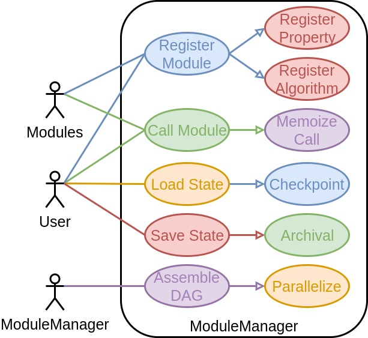
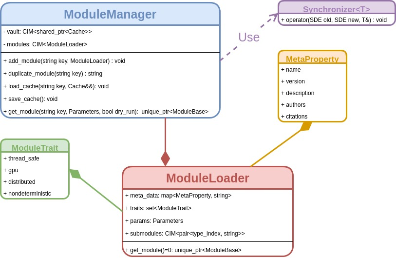

@page mm_api Module Manager API

The present page describes notes and thought processes related to the 
formulation of the ModuleManager class.

[TOC]

@section mm_api_use_cases Use Cases

The ModuleManager class is conceived as being the automated overlord of the SDE.
The mechanisms available to it are the same mechanisms available to module 
developers looking to maximize performance.  To that end, the ModuleManager 
class's use cases and users are depicted in the following use case diagram.



The following subsections describe the use cases in more detail. Ultimately 
the use cases suggest that that the ModuleManager API consider the following:

- Possible to register modules without modifying the SDE library.
- Need to register default Parameters and submodules
- Users should be able to copy modules
- Module state should be stored external to the module
- Stored state needs updated when control moves to a superset/subset of 
  processes   
- Meta data should be usable without spawning a module  
      

@subsection mm_api_register Registering Modules

Before a module can be used, the ModuleManager will need to be made aware of the
module.  This process, called registering, makes the ModuleManager aware of the 
algorithm's existence (the literal function to be called) and the properties 
it can compute.  *A priori* it is difficult to conceive of all possible 
properties and algorithms, therefore it becomes essential that new algorithms 
and properties can be registered without having to modify the source code of the 
SDE. Exactly how a module is registered depends on which of the available 
[module APIs](@ref module_api_considerations) is used with the SDE. Assuming the
use of a model possessing a base class, this suggest that the ModuleManager API 
should be such that the base class of the module hierarchy is sufficient to 
register the module's algorithms and computable properties. 

There are two main ways a user can interact with a module: direct input and the
Parameters class.  In order to avoid having to forward the Parameters class
through a nested module call tree, we will insist that the user can simply tell 
the ModuleManager which module's Parameters to change.  This in turn implies 
that the ModuleManager is able to see the Parameters provided by a module, 
*i.e.* they must be registered.  A similar scenario exists for the submodules it
will call.


@subsection mm_api_props Properties

Registering modules will happen relatively transparent to the user via start-up 
scripts.  Thus, from the user's perspective, the most common interaction with
the ModuleManager will be to compute properties.  The ModuleManager's role in
this endeavor is to set-up and return the requested module.  More specifically, 
since the module's state is actually stored in the ModuleManager, it is only
possible to get a working module from the ModuleManager.

The uniform storage site for modules can cause problems for parallel operations.
For this reason we will require a module to be "locked" after it is 
instantiated.  What this means is that once a user has requested a module no 
further changes can be made to the module's Parameters or the submodules it will
call (the submodules will also be locked).  For this reason it will prove 
necessary to be able to copy a module.  The module a user gets is ultimately an
instance, so what copying does is it ensures we can have multiple instances, in
a parallel safe manner, at any given time.

@subsection mm_api_save Saving/Loading Module State

In most computer programs the ability to save and load program state is a given.
Historically in computational chemistry this has not been the case.  One of the
use cases of the SDE is to rectify this.  To that end we note that to the extent
that the program is simply the module call graph, the ModuleManager is in a 
position to easily save/load the program's state.  We want this process to be as
automated as possible.  

There is at least one other consideration related to saving/loading state and
that is managing distributed states.  Generally speaking, given a result 
distributed over some set of processes, additional considerations are required 
in order to access that result from a different set of processes.  
Considerations are also required for replicated objects trying to be accessed
from a superset of prcesses.  Either way, the point is there needs to be a 
mechanism to adjust cached data so that it is accessible on different sets of
processes.

@subsection mm_api_micro Micromanaging A Calculation

For the most part modules are opaque to the ModuleManager.  That said, in order
for the SDE to micromanage the calculation it is necessary for the module to 
tell the SDE about itself.  Generally speaking this can be thought of as a means
of introspection.  Arguably the most important means of introspection is to 
ascertain the resource cost of calling a module with a particular set of 
arguments.  Examples of resources of interest are: time, processes, threads, and
memory.

Given the overarching goal of parallelization, it will fall to the ModuleManager
to perform coarse grained parallelism over the modules.  Even when 
coarse-grained parallelism is not possible, the ModuleManager should still be
able to set-up the parallel environment for the module.  For example, by knowing
that a module can use up to, say, ten processes for a given input, allows the
ModuleManager to split the communicator for the module before it is called.   

@section mm_api_purposal  ModuleManager API

For the most part the API of the ModuleManager is pretty tied to that of the 
classes it uses (particularly the Module API).  The following represents a
rather straightforward implementation that satisfies the points raised in the
previous section.



Notably, modules are added to the ModuleManger via ModuleLoader instances.  
These somewhat opaque classes shield the ModuleManager from the actual details
of the Module, such as it's actual type.  The remaining members of the
ModuleLoader represent the static metadata and initial state of the module.
More specifically the `meta_data` member is a set of strings describing basic
information such as who wrote the module, what version it is, and what papers
should be cited to use it.  The `traits` member allows the developer to flag the
module as possessing certain traits such as thread-safety or non-determinism.
These traits can be used to steer control flow.  The `params` member contains 
the default parameters for the module.  Finally, we assume that each module 
needing to call a submodule does so at well defined points.  To each of 
these points the module developer associates a name.  Then the `submodules` 
member contains a map of keys for submodules such that 
`submodules["submodule"].second` is the key to provide to the ModuleManager's
`get_submodule()` routine in order to get the module at point `"submodule"`.
`submodules["submodule"].first` is the `type_index` of the class that should
implement the algorithm and is used internally for error-checking.

Below is a basic example of how to declare a module that computes an energy
derivative.  We assume that the base class for such a property is
`EnergyDeriv<0>`:

```.cpp
// This would be our implementation
class MyEnergyDeriv : public EnergyDeriv<0> {
public:
    CIM<Tensor> operator(const System& sys) override {
       // method definition goes here
       return energy;
    }   
};

/*
 * We assume our module:
 * - Is called "My Awesome Energy Method" for documentation and logging 
 *   purposes
 * - Is at version 0.0.0 
 * - Has no special traits
 * - Takes a single parameter, which we call "Option 1".  That parameter is of
 *   type double, defaults to 1.0, and is described as "My first option" for
 *   documentation and logging purpoes.
 * - Our module will call one submodule.  We label this call "submodule1" and
 *   default it to be whatever module is registered with the key 
 *   "Method to call".  That module should be derived from EnergyDeriv<0>.
 */ 
class MyEnergyDerivLoader : public ModuleLoader {
public:
    MyEnergyDerivLoader() {
        meta_data[MetaProperty::Name] = "My Awesome Energy Method";
        meta_data[MetaProperty::version] = "0.0.0";
        
        params.insert("Option 1", Option<double>{1.0, "My first option"});
        
        submodules["submodule1"] = 
            std::make_pair(EnergyDeriv<0>{}.type(), "Method to call");
    }
     
    std::unique_ptr<ModuleBase> get_module() const {
        return make_unique(MyEnergyDeriv{});
    }           
};            
```  

Aside form the ModuleLoader class the rest of the API is largely 
straightforward.  Modules are registered using the `add_module` member function,
duplicated using the `copy_module` member function, and retrieved with the
`get_module` member function.  Calling `save_cache` will cause the Cache to be
saved, whereas calling `load_cache` will allow one to read in another Cache.
The remaining class, `Synchronizer`, is used for synchronizing the results
stored in a Cache when the set of processes changes.  More specifically it can
be specialized for a given type if need be. 

| Pros                        |                                        Cons|
| --------------------------- | ------------------------------------------ |
| 1. Easily wrapped in Python | 1. Manually need to assemble call sequence |
| 
