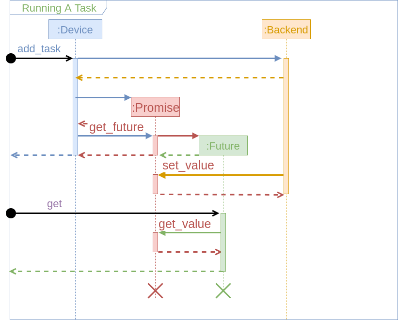
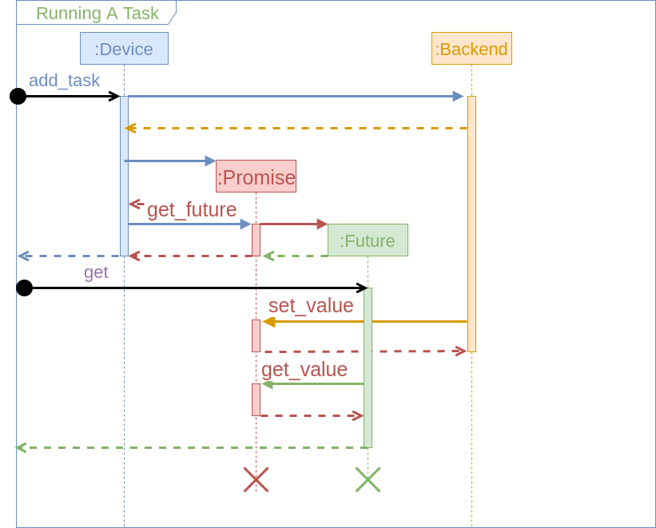
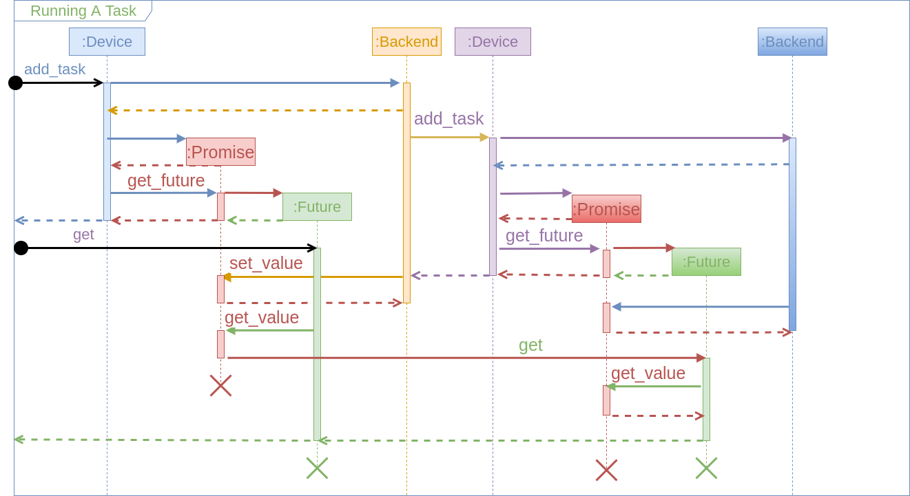

ParallelRuntime Details
=======================

DeveloperDox provides a top-level overview of the `ParallelRuntime` class. This
page, however, is meant to provide a lot more of the gritty details.  It should
be noted that the `ParallelRuntime` class is focused on task-based 
parallelism.  In electronic structure theory, data-based parallelism almost 
always occurs in the context of tensors and we defer implementation of such 
parallelism to those classes. 

Overview
--------

As the name implies, task-based parallelism achieves parallelism by 
simultaneously executing tasks on different hardware components.  Here, by a 
task we really nothing more than a function call.  Hence in task-based 
parallelism we need:
 
1. Some "queue" structure that can be given a series of tasks
   - The queue is responsible for executing the tasks and returning the results
2. Some "placeholder" structure that represents the result of the task
   - Placeholders are used so the program can continue to do other things while
     waiting for the result      
3. A means of combining the results of many function calls (*i.e.* reduction)

Strictly speaking number three can be written in terms of numbers 1 and 2; 
however, it occurs often enough it is useful to provide an abstraction for it.

The above three bullet-points seem almost trivial to implement until one 
considers the actual hardware elements that the tasks need to be mapped to.  
More specifically modern computers are formed of a hierarchy of computing 
resources.  At the top-level all modern super computers are actually many 
individual nodes networked together.  Within each node there exists CPUs, 
GPUs, and MICs, within all of which resides the individual cores, within 
which is multiple vector registers.  Making matters more complicated the data
does not reside in one central location, but rather is spread amongst many 
separate, spatially distinct, locations.  Hence one also needs to worry about
transferring the data.

The purpose of the ParallelRuntime class is to insulate the science within 
the NWChemEx program from the hardware computing the science.  A variety of 
libraries exist that provide some level of task-based queue abstraction on top 
of one or more of the target hardware devices.  Thus the second role of the 
ParallelRuntime class is to insulate the remainder of the NWChemEx program 
from the semantics of the library providing the actual parallel abstractions 
for a particular backend.  

Possible Backends
-----------------

At this point this is just a list of libraries I'm aware of for task-based C++ 
computations written down for posterity.

- UPC++ [home](https://bitbucket.org/berkeleylab/upcxx/wiki/Home)
- Kokkos [home](https://github.com/kokkos/kokkos)
- Intel's Threading Building Blocks [home](https://www.threadingbuildingblocks.org/)
- HCLib [home](https://github.com/habanero-rice/hclib)
- C++ Actor Framework [home](https://github.com/actor-framework/actor-framework)
- Madness [home](https://github.com/m-a-d-n-e-s-s/madness)
- Raja [home](https://github.com/LLNL/RAJA)
- Thrust [home](https://developer.nvidia.com/thrust) 
- DARMA [home](https://share-ng.sandia.gov/darma/)

For completeness the following also exist, but have been ruled out:
- PaRSEC [home](http://icl.utk.edu/parsec/)
  - Not native C++ (requires an intermediate JDF format)
- Charmm++ [home](http://charmplusplus.org/)
  - Not native C++ (requires special compilation steps)
- Cilk [home](https://www.cilkplus.org/)
  - Being deprecated by Intel as of 2018 and abandoned by 2020

Running Tasks
-------------

Initially we will treat the actual mechanism behind the parallel execution 
(*i.e.* the scheduler, memory movements, *etc.*) as an opaque class `Backend`.  
Under this assumption, the following sequence diagram details the procedure 
that occurs when a user wants to run a task in NWChemEx.  

At least for the time being, we assume that we can not automate the device 
selection for you (that is to say you as the user of a `ParallelRuntime` 
instance are the only one who knows what device your algorithm can/will run 
on).  As a result, the first step (not pictured) is to select the device 
you will run on.  The next step is to add your task to its queue; this is done 
via the `add_task` member of the device.  This example is only concerned 
with adding a single task, but adding multiple tasks would be done in a 
similar manner.  When you call `add_task` ultimately the device will do two 
things: forward your task to the backend and create a `Promise` instance.  
Exactly how this is done is backend specific, but what matters is that the 
`Promise` instance is the buffer that will eventually hold the result of your
task.  After ensuring your task is scheduled and the result will be 
forwarded to the `Promise` instance, the `Device` instance creates a 
`Future` instance and returns it to you the user.  The `Future` instance is 
your "claim ticket" to the result.  Once your task has finished the `Future`
instance can be used to retrieve the result, in the mean-time it is simply 
a stub.  When you want your result you call the `Future`'s `get()` member 
function.  As drawn, the user waited a length of time longer than that of the
task (*i.e.* the task finished before the user asked for the result).   In 
this case `get()` simply returns the result.  The following sequence diagram 
depicts what happens if the task hadn't finished yet.

In this case `get()` essentially behaves as a barrier and the user must wait 
for the task to complete.  Consequentially, to get the maximum parallel 
efficiency it is important to schedule tasks early and to ask for the results
at the last possible second.

The above diagrams focus on a relatively simple use case, running a single 
task on a single device.  In practice, we often have a hierarchy of devices 
available and we will need to nest parallelism.  The following diagram 
illustrates one possible nesting situation (in general there's four scenarios
 depending on when the tasks finish).
 
 
 
Essentially, the situation is similar to above except now when the first 
task starts running (the orange bar) it returns a `Future` instead of the 
actual result.  Then when the user calls get on the `Future` they received it
simply calls `get` on the `Future` inside it so on and so forth.  Whether
the various `get` calls are blocking or not depends on whether the tasks have
finished.  As drawn the outer `get` call is blocking because the user calls 
`get` before the inner `Future` is in place.  When the inner `Future`'s `get`
 is invoked the task has already run thus the inner `get` is non-blocking. 

Wrapping the Backends
---------------------

Now that we have an API we have to worry about wrapping the backends.  In 
particular this means we need to consider: 

- Not all backends support asynchronous execution
- Backends may need to move data
- Only backend knows data's location and must be queried for it 

Making a synchronous library asynchronous is the easiest of these problems 
and can be handled by spawning a thread that will actually schedule the task 
with the backend (we in turn loose a thread, which can be mitigated by making 
the thread sleep).  At least initially we avoid the memory movement problem 
by requiring all tasks to copy their state and by copying the task results 
back for the user.  The copy convention allows us to avoid questions of data 
locality for the moment.

Resource Management
-------------------

The key to modern supercomputers is hierarchical parallelism.  Within our 
present API each level of the hierarchy is given its own device.  For the 
moment we require the user to select the appropriate device.  Long term the 
runtime needs to be smarter about this as it's the only thing in a position to
know what level of the hierarchy a task is executing in.  For example 
consider the difference between running a single SCF computation and a finite
difference SCF gradient.  In the former you likely will want to distribute 
your tensors over the processes, whereas in the latter you probably want to 
distribute the SCF computations themselves over the processes.  Complicating 
things its reasonable that say the finite-difference alone doesn't saturate 
the processes, hence we will want to nest that parallelism in order to make 
sure each process is doing something (say let each finite difference 
computation distribute its tensors over four processes).  At the moment we 
assume that the backends are smart enough to handle this as part of their 
load balancing.
