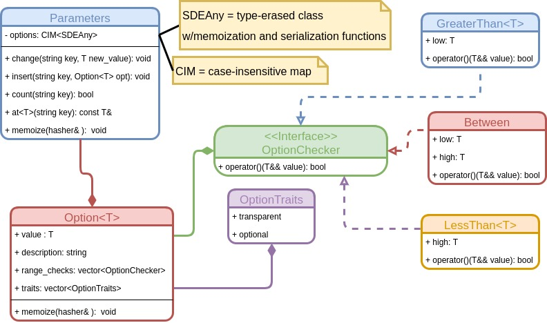
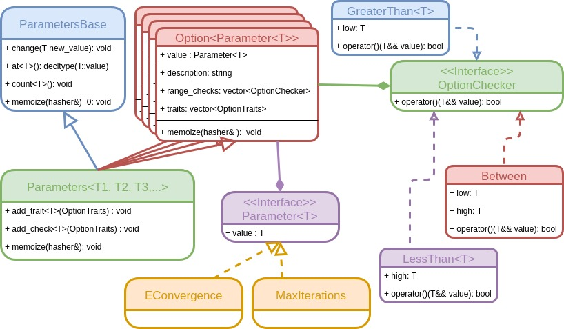

@page parameters_api Parameters API

[TOC]

The current page describes the Parameters class and the classes associated 
directly with its implementation.  The Parameters class is envisioned as being
used to provide algorithmic parameters.  Many of the 
[purposed Module APIs](@ref module_api) also take explicit parameters in 
addition to the parameters hidden within the Parameters class.  For the purposes
of this page, we do not concern ourselves with the distinction.

@section parameters_api_uses Use Cases

The following use case diagram depicts the intended uses of the Parameters class
and the users each use case is targeted at.


The following subsections describe the use cases in more detail.  The result of
the discussions in these subsections is the realization of the following 
additional points concerning the Parameters class: 

- Must support arbitrary options
- Addition of options should be decoupled from SDE
- Metadata available for each option
- Arbitrary validation checks on options
- Autogeneration of documentation should be possible 

@subsection parameters_api_input Storing Input

By far and away the main role of the Parameters class is to wrap the input to a
module in a self-contained class.  Given the flexibility we are attempting to
afford to module developers it is essential that the Parameters class be equally
as flexible.  To that end the Parameters class must be able to hold arbitrary
options and (somewhat) arbitrary values.  Furthermore it should be possible to
add these options without having to modify the SDE's source code.

The primary use case of "storing the input" means that the Parameters class will
play a key role in memoization and archival of a module's results. More
specifically these use cases resolve around recording the available options and
their current values.  Unique to the memoization use case we will need to know 
which options are "transparent" (their value does not affect the result of the 
module).  This suggests that it will be necessary to include some metadata along
with each option.   

@subsection parameters_api_validate Validation   

There is a large amount of boilerplate code in many computational chemistry
packages related to validating options.  A bit more specifically it is not
uncommon to see something like:

```.cpp
return_type my_fxn(option_type1 option1, option_type2 option2, ...) {
    if(option1<=0) 
        throw std::runtime_error("option1 must be greater than 0");
    if(option2 > 100)
        throw std::runtime_error("option2 must be less than 100");
    ...        
}
```

at the beginning of every function that takes a set of options.  Particularly
when options are being managed by a class this need for boilerplate creates a
coupling between that class and the validation checks.  For this reason we note 
that one use of the Parameters class itself should be to verify that all the 
options provided to it are valid.  Owing to the somewhat arbitrary nature of 
the options that the Parameters class manages it follows that the Parameters 
class will need to support a wide variety of validation checks.  It is also 
conceivable that validation checks for an option may depend on the value of 
another option, the available resources, or the explicit input to a module.

Related to verification is simply knowing that all required options are set. 
Such a validation check is in particular needed when there is no logical default
value for an option.


@subsection parameters_api_define Defining Options

Up to this point we've assumed that the Parameters class can hold arbitrary 
options.  The reality is most modules will not support arbitrary parameters, but
rather will only recognize a few parameters.  For this reason we expect modules
to provide a Parameters instance that is pre-loaded with all recognized options
and their default values.  Of course not all runs will use the default values so
a mechanism must exist for updating them (and subsequently validating them).

Assuming each option is also tagged with a useful description, this means it is
possible to autogenerate documentation for a module's options simply by looking
at its default Parameters instance.  Such autogeneration will prove useful for
ensuring that a module's documentation remains up to date with modifications and
may also conceivably lend itself to interactive usage of modules.

@section parameters_api_choices API Choices

The last section explored the use cases of the Parameters class, this section
provides some possible APIs for it.  Before we do that we note that all of
these solutions hide the option's types in some shape or form.  While okay for
most use cases we note that serialization becomes complicated in that inside
the parameters object we don't know the types of the objects and thus can't
cast to them in order to serialize.  The result is we'll need some help from the
module developer (in the form of them implementing the serialization functions).

@subsection parameters_api_pythonic Pythonic

To some extent the Parameters class is a C++ realization of Python's keyword 
arguments (kwargs) concept with some additional bells and whistles specifically 
designed around its intended usage.  The first purposed API embraces that.



In this API the name of the parameter is stored as a string and the value is 
type-erased using the SDEAny class.  Clearly such a strategy is suitable for 
arbitrary options and is extendable without needing to rewrite the SDE.  The 
actual option is stored in a little wrapper class that associates with the 
value the metadata and validity checks.  In practice standard usage of this 
class would be something like:

```.cpp
//Declare an instance
Parameters params;

//Add our options (this would be done by the module to specify its defaults)

// Bare minimum way to add an option (no description or checks)
params.insert("The number 3", Option<int>{3});

// Better has description, but no check
params.insert("Pi", Option<double>{3.14, 
  "The ratio of a circle's circumfrence to its diameter."});
  
// Best has description and checks
params.insert("Not a negative number", Option<int>{4, "Any positive number",
  {GreaterThan<int>{-1}}};
  
  
// See if params contains an option "Hello World"
bool has_hello_world = params.count("Hello World");

// Be malicious and change the value of pi (the world will never be the same)  
// Note: this would trigger the value checks (if any exist)
params.change("Pi", 4.14); 

//Get the number 3
auto the_number_3 = params.at<int>("The number 3");
```

As can be seen it behaves roughly akin to `std::map` with the caveat that, 
because of the type-erasure, retrieval of elements needs to be templated.  
Somewhat ironically, this last point means that wrapping this API in Python will
require additional considerations.  In particular we may need to limit the types
of the options to a select few so that we can manually cast the SDEAny instance
before moving data to Python.  This requirement is removed if the SDEAny class 
can instead return a Python object instance.

| Pros                    | Cons                                             |
| ----------------------- | ------------------------------------------------ |
| 1. Little templating    | 1. Typos are runtime errors                      |
| 2. Printable keys       | 2. Type cast error is runtime error              |
|                         | 3. Without standards names can change per module |
|                         | 4. Type erasure makes serialization difficult    |
|                         | 5. Additional considerations to wrap in Python   |


Note some standardization and mitigation against typos could be done by 
defining string constants (likely in a `Parameters` namespace to avoid 
collisions) akin to:

```.cpp
constexpr auto Pi = "Pi";  
constexpr auto TheNumber3 = "The Number 3";
constexpr auto NotANegativeNumber = "Not a Negative Number";
```

and using these constans instead of the strings they are set to.  By doing this 
the compiler will complain if one mistypes (although the error will be slightly 
vague).  Since these are ultimately still strings (well technically C-style 
strings) we don't sacrifice flexibility in the option names.

@subsubsection parameters_api_python_variant Pythonic Variant Variant

If we agree on a subset of types, it makes more sense to replace SDEAny with a
variant class (basically a type-safe union).  Since each instance of this class
would then only contain one of the several possible values it becomes 
possible, albeit messy, to serialize the Parameters instance automatically for
the module developer.  It also allows us to do the necessary casts automatically
in order to pass an object to Python.  It should be noted that use of a variant
class does not mitigate runtime checking.

@subsection parameters_api_cpp C++

The Pythonic API relies heavily on strings, which is typically frowned upon by
C++ developers for a number of reasons (many of which are listed in the cons
section of the previous section).  The following C++ API substitutes strings 
for strong types (essentially structs whose type serves as a description of 
what the member's value is).  



Like anything in C++ having to do with types, the resulting API is template 
heavy; however, much of this templating is for implementation only.  Other than  
the more prevalent usage of templates the entire class hierarchy behaves quite
similar to the purposed Pythonic API.  Creating a Parameters instance is 
done *via*:

```.cpp
// Some pre-defined ones will come with the SDE for convenience, but developers 
// can always write more.  Here's the definitions of the options from above

struct TheNumber3{int value;};
struct Pi{double value;};
struct NotANegativeNumber{int value;};

// Part of the Module API is how the default parameters are provied to the SDE
// and users of your module.  This will be done with a function.  We just call
// this function get_params for now.

std::unique_ptr<ParametersBase> get_params() const { 
    // make_parameters is a helper function provided by the SDE
    // the return type is Parameters<TheNumber3, Pi, NotANegativeNumber>, but
    // you don't need to know that...
    auto da_params = make_parameters(TheNumber3{3}, Pi{3.14}, 
                                     NotANegativeNumber{4});

    // Here you set the validity check on the NotANegativeNumber option               
    da_params.add_check<NotANegativeNumber>(GreaterThan<int>{-1});
    
    // Return our set-up Parameters instance
    return std::make_unique<ParametersBase>(std::move(da_params));
}
```

As part of the input to a module you will receive a Parameters instance (*via*
its base class ParametersBase).  Usage of the instance is like:

```.cpp
//Inside your module 
const ParametersBase& params;// provided to you

//Type of pi would be double
auto pi = params.at<Pi>();

// See if the the Parameters instance contains an option HelloWorld
// Note: HelloWorld struct would need to have been declared already, and since
// this is your module's parameters you should know that it does/doesn't have
// such a member so this is purely illustrative...
bool has_hello_world = params.count<HelloWorld>();
``` 

Users of a module wanting to modify parameters before they are given to the
module would simply do:

```.cpp
auto params = get_params();

// Note 
params->change(Pi{4.14});
```

As with the Pythonic API, templates require additional Python wrapping 
considerations.  Whereas the Pythonic API involved templates on the types of a
parameter's value, the C++ API requires templates on both the parameter key and
the parameter value (the latter is somewhat hidden by the fact that it can be
determined from the former).  At the moment the only solution I can think of 
(and it's not a good one) is to essentially use the Pythonic API under the hood
where the string keys are now derived from the mangled type names.


| Pros                        | Cons                                           |
| --------------------------- | ---------------------------------------------- |
| 1. No strings               | 1. Lots of templates                           |
| 2. Keys checked by compiler | 2. Type checks are at runtime                  |
|                             | 3. Printing non-mangled types is tricky        |
|                             | 4. Can't serialize through base class          | 
|                             | 5. Slightly awkward syntax to avoid slicing    |
|                             | 6. Much harder to wrap in Python               |

@subsection parameters_api_other_thoughts Other Thoughts

These are just some somewhat random notes on other designs/thoughts regarding
the Parameters API.  They are here for posterity.

- Named Parameter Idiom is standard C++ way to implement kwargs
  - Won't work here because the names of the functions would change per module
    - This is because member names are the same as paramter names
  - Would have to register names in a map or something, which is basically the
    Pythonic API
- Enums for keys is not extensible because new keys could only be added by 
  modifying the SDE 
- Do we even need to serialize parameters?
  - Parameters are only in the cache via the hash of the input
  - Major use-case would be for running modules in parallel and collecting the
    parameters each module was run with (for archival purposes)
    
