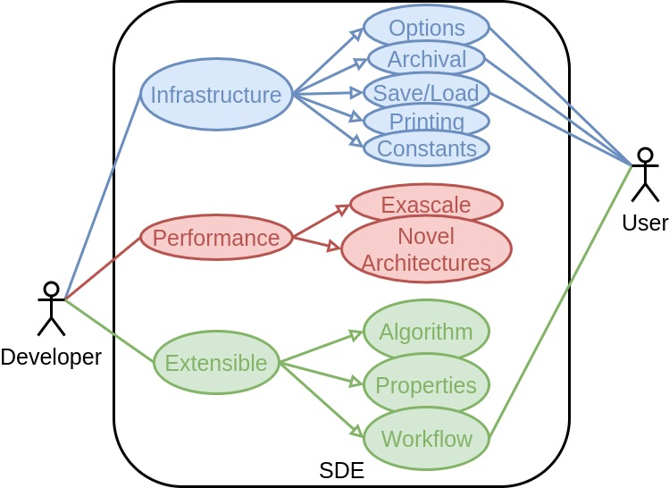
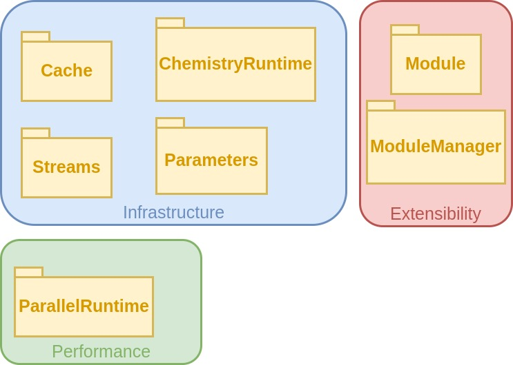

@page sde_overview SDE Overview

This page is meant to be an overview of the SDE library.  In rewriting NWChem as
NWChemEx all of the typical infrastructure for a computational chemistry program
needed to be rewritten.  The decision was made to write the infrastructure in a
manner that is largely decoupled from the underlying computational chemistry
algorithms.  The result of this infrastructure refactoring is the SDE library.

[TOC]

@section sde_overview_use_cases Use Cases

The following use case diagram depicts the use cases of the SDE library and the
users they primarily target:

The following subsections describe these use cases in more detail and discuss
the implications they impose on the classes and features the SDE must possess.
To summarize:

- Support basic infrastructure (*e.g.* options, printing, archiving)
- Not impede parallel performance (aiding when feasible)
- Decoupled from the build of the algorithms
- Decoupled from available properties/algorithms
- Must support a Python wrapper

@subsection sde_overview_infrastructure Infrastructure

The primary motivation for the SDE is to implement the infrastructure needed for
a computational chemistry package.  This has many facets including: 

- tweaking algorithm settings (*i.e.* options),
- long-term records of calculation (*i.e.* archival)
- checkpoint/restart of calculation
  - includes intermediates not typically archived
- printing/log file 
- pre-tabulated data (*e.g.* constants, basis sets, force fields)

Most computational chemistry packages have implemented their own solutions to
the above and the inclusion of infrastructure for these use cases is not novel,
but simply a necessity.

@subsection sde_overview_performance Performance

Ultimately, NWChemEx is focused on being performant on exascale platforms.  More
generally we would like the SDE to be peformant on a wide-range of 
architectures.  For the most part the SDE is not going to be the component that
achieves this performance.  Rather we expect performance gains to be the results
of the algorithms added to the SDE by the developer.  Nonetheless it is 
important that the SDE keep performance in mind so that it does not impede it.
This implies:

- The SDE must be thread-safe
- The SDE must be designed so as to not inhibit distributed parallelism
- Builds of the SDE should be decoupled from the algorithms used by the SDE
  - Allows algorithm builds to use architectures/build tools not known to SDE
  
Where possible the SDE should do what it can to aid in parallelism and 
performance.   
    
@subsection sde_overview_extensibility Extensibility

Anticipating every possible type of computational chemistry calculation that a
user may want to do or every possible algorithm a developer may come up with is
likely impossible.  At the same time we want the SDE to be able to accommodate
these calculations/developments when they do occur.  For this reason the SDE has
been designed with extensibility in mind.  In particular this means:

- Adding algorithms to the program should be possible without requiring the SDE
  to be modified
- Algorithms need to be self-contained aside from the input given to them by the
  SDE
- The list of properties must be dynamic

Extensibility also facilitates interoperability.  More specifically it 
should be possible to use existing libraries with the SDE without directly 
modifying the SDE (given the lack of standard APIs in the field of computational
chemistry, developers will likely need an adaptor class; thus this doesn't 
satisfy the true definition of interoperability, but it does come reasonably 
close given the state of the field).  The reverse should also be true, 
namely, because code developed for the SDE will need to be self-contained it 
should be reasonably straightforward to call those codes from other 
computational chemistry packages.

Another important extensibility consideration is how the program resulting from
the SDE integrates into the user's workflow.  A user rarely runs calculations
with the intent of gathering only a few numbers.  Typically the user has whole
test sets to run or parameter spaces to sweep.  Once the results are in they 
need processed.  It is thus an important consideration that the SDE be able to
integrate into current workflows as well as possible future workflows.  Python
is quickly becoming the *de facto* standard in computational chemistry for such
endeavors and we require that the SDE be capable of providing Python bindings. 

@section sde_api_components Components of the SDE

Ultimately to meet the use cases laid out in the previous section we have 
decided to fashion the SDE as a framework.  This framework has several
components:

- Parameters: These objects will handle the packaging of user inputs
- Streams: These objects will be responsible for printing
- Cache : This is the state of the program
- ChemistryRuntime: This object stores the empirical chemical data needed for a
  run.  Users of the SDE can add to it or modify it if they wish.
- Module: These are the algorithms developers write to provide a property
- ModuleManager: This is the object responsible for dispatching to the 
  appropriate module at the appropriate time
- ParallelRuntime: This the collection of objects providing managed parallel 
  resources to Modules  
