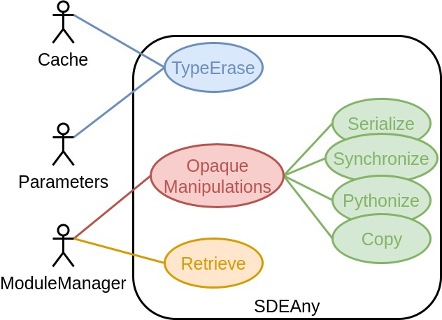
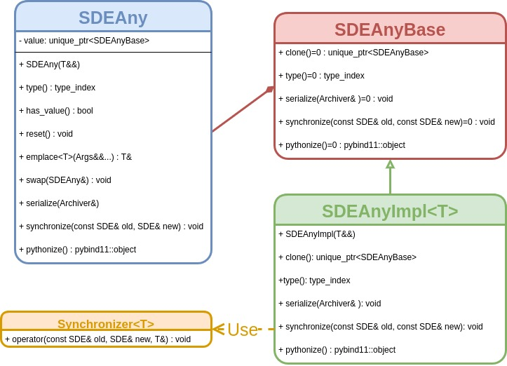

@page sdeany_api SDEAny API

[TOC]

The current page focuses on the design decisions behind the SDEAny class.  
The design of the SDEAny class is basically ripped right from `std::any` with
some additional bells and whistles.

@section sdeany_api_use Use Cases

The following UML use case diagram describes the intended use cases for the 
SDEAny class.



The primary use case for the SDEAny class is to provide type-erasure 
capabilities to the Cache and Parameters classes.  In both cases our classes
need to be capable of storing objects of arbitrary type.  The objects wrapped
in the SDEAny 

@section sdeany_api_api Purposed SDEAny API

Type-erasure is pretty-common design aspect in C++ programs.  The prevailing
way of doing type-erasure is with a class like `std::any`.  There's two 
problems with `std::any`.  One, it's C++17.  Two, it doesn't expose any generic
manipulations (in our case we need to serialize, synchronize, *etc.*).  
Unfortunately, adding such functionality requires modifications to the base 
holder class (specifically one must add virtual functions that are overriden by 
derived holder class).  For these reasons we are rolling our
own "any" class.  The following UML diagram details the API:



The API itself is basically just `std::any` with the necessary additional 
methods.  Typical usage of the class is something like:

```.cpp
SDEAny wrapped_double(3.14);

// Get our double back
auto our_double = SDEAny_cast<double>(wrapped_double);

// Request the object be serialized using the archiver MyArchiver 
wrapped_double.serialize(MyArchiver);
```
