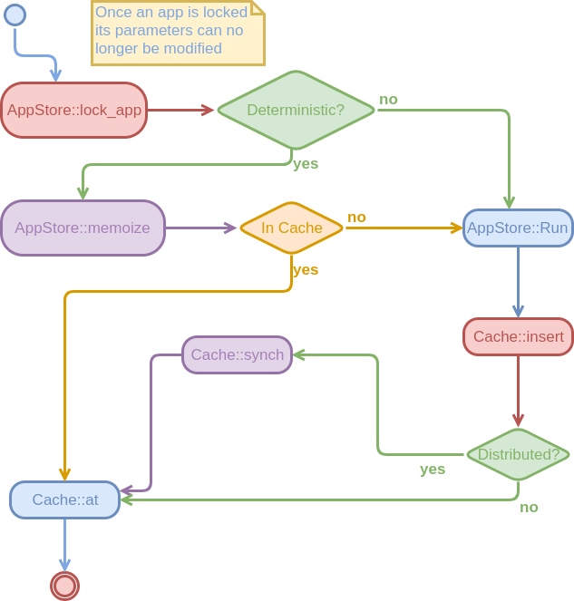

Memoization
===========

A large part of the SDE relies on memoization.  This page discusses those 
efforts in more detail.  Note everything on this page applies to 
deterministic apps, non-deterministic apps can not be memoized.

Assumptions
-----------

- App is deterministic
- App completes successfully
  - Apps that fail should throw and thus not generate results to memoize
- App can only get input from the SDE, System or Parameters instances it is 
provided (subapps ultimately come from the SDE instance)
  - Apps should not write their own files or write to a global variable. 
  - Parameter instance is unique per key
- To replicate a call to the app it suffices to memoize the output of the app
  - Invoking the app has no side-effects aside from generating the result 

App Input Procedure
-------------------

To reason about memoization we need to understand when and how the input to an
app can be modified.

### Step 1: Default Values

When an app is developed the developer puts all parameters the app depends on in
a Parameters instance in the AppInfo accompanying it.  Each value is in one of 
the following states:
1. Not set
   - Values in this state may be either:
     - Optional, the app can run without the value being set
     - Required, the app must have this value set by the user in order to be run
       - Should only be used if there is no reasonable default
2. Initialized to some default value

An app will always be originally loaded with its default values.

### Step 2: User Default

When a run starts a user may override one or more defaults for an app.  
Tentatively we assume this is done before any calls to an app.  For all intents
and purposes this establishes the defaults the SDE actually uses.  It is assumed
that this step is always done during some initial serial phase.  Parallel 
invocations of apps with different inputs and settings are best done in the 
next step.

### Step 3: Locking the App

The first thing that occurs when `SDE::run` is called is that the app and all 
sub apps that it may call are locked.  If all parameters were passed through 
`sde.run`, instead of some being defaulted, then this step would be unnecessary.
Since it is impractical to ask the user to set all parameters, for every call, 
we have instead opted to lock the parameters that will be injected.  Locked 
parameters are locked in the sense that attempting to change the default 
parameters of a locked app is an error.  That is to say this locking is not in 
the typical mutex sense.  Anyways, by locking the parameters we can guarantee to
the user that subsequent invocations of an app, with exactly the same input to 
`sde.run`, will produce the same result.  This is only guaranteed because 
threads can't change the defaults out from under those calls.

### Step 4: Final Parameters Set

Although a lot happens in `SDE::run`, for our current purposes the last 
relevant step is when that parameters passed to `SDE::run` are merged with 
the default parameters (those passed to `SDE::run` taking precedence).  
Consequentially, it is the SDE instance, System instance, and resulting merged
parameters that constitute the final input to an app.


Memoization Process
-------------------

With a better understanding of how the final input to an app comes to be we are
now in a position to discuss the memoization process.  The actual procedure 
occurs in `SDE::run`, the flow of which is depicted in the following UML 
diagram.



The actual memoization process involves the following steps:  

1. `AppStore::memoize()` is called with the SDE instance, the molecular system 
and the Parameters instance provided to `SDE::run`.  
2. Inside `AppStore::memoize()` the AppStore the input Parameters set is 
merged with the locked default Parameters set (again input set taking 
precedence).  
3. `AppInfo::memoize()` is called with the SDE instance, the molecular system,
and the merged Parameters set.
4. The inputs to `AppInfo::memoize()` are hashed and the result returned to 
`SDE::run`
5. SDE checks the cache to see if a result with that hash exists.  
   - If result has been cached it is returned.
6. If no result exists `AppStore::run` is called to compute the result
   - Note that users wanting to avoid caching of a result can directly call
   `AppStore::run`
7. After the result is computed `SDE::run` adds the result to the cache.
8. The result is returned

Memoization Considerations
--------------------------

### Specifying Which Inputs Impact the Result

As detailed in the last section the goal is to have the memoization process 
be largely automatic.  Unfortunately, the black-box nature of an app makes it so
that the AppStore does not know exactly which elements of the SDE, System, and 
Parameters instances passed to an app actually influence the result.  By default
we take the conservative approach and assume that all elements of these 
instances do.  Generally speaking this is massive overkill and will result in a
quantity being recomputed more times than it should.  To avoid this we allow the
app developer to override the `AppInfo::memoize()` function.  A typical 
implementation would look something like:

```.cpp
hash_type DerivedAppInfo::memoize(const SDE& sde, const System& sys, 
                                  const Parameters& params) {
    Hasher h;
    
    // If anything from the SDE instance impacts your output hash it here.
    // We'll pretend that the ChemicalRuntime instance does (it probably 
    // shouldn't)
    h << sde.crt;
    
    //  Usually the entire system impacts a computation
    h << sys;
    
    // For convenience you can label parameters that don't affect the output 
    // and they will automatically be skipped
    h << params;
    
    // Finally we also need to include the hashes of the subapps we call
    // Recall AppInfo::subapps is a map from the name to the key to call
    for(auto key_val : subapps){
        //In general need to pass any modified parameters to this function also
        h << sde.play.memoize(key_val.second, sde, sys);
    }
    
    return h; 
}                                   
```

Note that even if you don't intend your app to be cached, it is worth 
implementing the `memoize` function anyways.  The reason is that apps that call
you will need to use it for their caching purposes.

TODO: Is AppInfo::subapps the right place for that array?

### Iterative Procedures

It may not be apparent at first, but memoization interacts with iterative 
procedures in a weird manner.  One of the most common iterative procedures in
computational chemistry is the SCF procedure.  In essence the SCF procedure 
takes some input matrix **D**, uses **D** to compute **F**, and then 
diagonalizes **F** to compute a new **D'**.  The process continues until 
**D'** differs from **D** to within some tolerance.

A first attempt at an SCF algorithm would look something like:

```.cpp
ResultType operator()(SDE& sde, const System& sys, const Parameters& params) {
    bool converged = false;
    while(!converged) {
        //Assume D is generated by an app with key "D Key"
        auto D = sde.run("D Key", sys);
    
        //Assume F comes from app with key "F Key" and gets D via "D Key" 
        auto F = sde.run("F Key", sys, Paramaters{"D", "D Key"});
        
        //Assume D' comes from app with key "D' Key" and gets F via "F Key"
        auto Dp = sde.run("D' Key", sys, Parameters{"F", "F Key"});
        
        //Opaque call to see if our D and D' are similar enough
        converged = check_convergence(D, Dp);
        
        //Set D to D' and iterate
        D = Dp;
    }  
}
```

where we've glossed over what keys are needed to retrieve the various matrices 
from the app outputs for brevity.  The astute reader will realize that in 
general this algorithm won't work.  More specifically it will generally iterate
forever (except in the rare case that your input **D** is already converged).  
This is because the app that builds **F** always gets the same **D** and 
consequentially the app that builds **D'** always gets the same **F**.  The fix
is straightforward:

```.cpp
ResultType operator()(SDE& sde, const System& sys, const Parameters& params) {
    bool converged = false;
    std::string d_key = "D Key";
    while(!converged) {
        auto D = sde.run(d_key, sys);
    
        //Copy F, make it call new D
        auto new_f_key = sde.play.copy("F Key");
        sde.play.change_option(new_f_key, "D", d_key);
        
        auto Dp = sde.run("D' Key", sys, Parameters{"F", new_f_key});
        
        converged = check_convergence(D, Dp);
        
        D = Dp;
        //Need to update key now too
        d_key = dp_key
    }  
}
```

This will now actually iterate, but it also will save a lot of intermediates.
For a general iterative algorithm these intermediates may be of some value and
the fact they are being saved shouldn't immediately be seen as a problem.  
Ultimately, what to do with the intermediates is something that probably needs 
to be considered on a case-by-case basis. To that extent, we point out that 
the page [XXX Cache Page Name](add link) discusses a user's cache options in 
detail, which also enumerates the possible routes an app developer may take 
to avoid excessive memory usage while still ultimately allowing the user to 
control whether or not the intermediates are saved.
   
There are (debatably) two other problems with this example. The first problem
is the user of this app's experience, specifically unless the user realizes that 
this is an iterative algorithm, a natural way to attempt to get the final 
converged value of **D** is by calling the app with the key `"D' Key"`.  This
however will (correctly) return the first **D'**, *i.e.* the one built from the 
original **D**.  For now we chalk this up to a "gotcha" and suggest that all
iterative algorithms should return the converged values.  The second problem is 
that this iterative syntax is awkward.  Ultimately, this stems from a combination 
of having to lock the subapp as well as each subapp obtaining **D**/**F** from a
subapp.  The syntax can be remarkably cleaned up by violating the usual 
rule-of-thumb and passing **D** and **F** through the Parameters instance 
(assuming the underlying app supports it): 

```.cpp
ResultType operator()(SDE& sde, const System& sys, const Parameters& params) {
    bool converged = false;
    auto D = sde.run("D key", sys);
    while(!converged) {
        
        auto F = sde.run("F Key", sys, Parameters{"D", D});
                
        auto Dp = sde.run("D' Key", sys, Parameters{"F", F});
        
        converged = check_convergence(D, Dp);
        
        D = Dp;      
    }  
}
```
