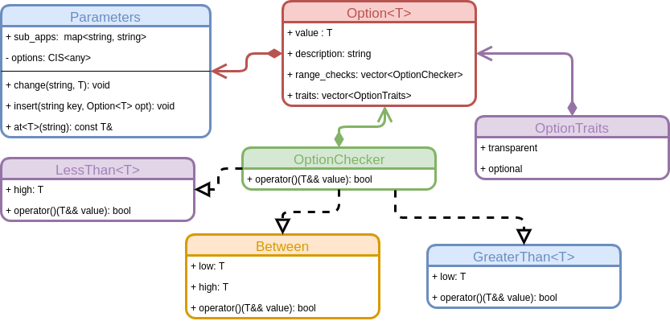

Understanding the Parameters Class
==================================

The Parameters class can be thought of as roughly akin to a Python function's 
kwargs (keyword argument) field.  The API of the Parameters class, as well as
its associated helper classes, are detailed in the following UML diagram.



The current page details best practices for how to use the Parameters class.

What is the Parameters Class?
-----------------------------

In computer science it is typically deemed good practice to pass all parameters
a function needs to that function (that is one should avoid hard-coding some 
of them).  The requirement by the SDE that all apps adhere to the same API 
necessarily restricts this.  To restore some API flexibility we introduce the
Parameters class (the remainder of the needed flexibility comes from apps 
being able to call other apps).  The Parameters class stores X kinds of 
input:

1. Memoization parameters: These are parameters that can influence the result
   of an app.  As the name implies they will be used to determine if 
   two inputs are identical.  Examples include thresholds and step sizes.  They 
   should be contrasted with:
2. Transparent parameters: these are parameters that under correct code behavior
   can not influence the result of an app (*e.g.* what to call files, logging
   level).
  

Adding a Parameter
------------------

Most computational chemistry codes have a concept of options, where the user can
specify things like the maximum number of iterations, thresholds for 
convergence, *etc.*  This tradition carries over to the Parameters class as 
well.  For example if your app depends on a parameter `"threshold"`, which is a
`double`, the simplest syntax for adding this to a Parameters instance is:

```.cpp
Parameters params;
params.insert("threshold", Parameter<double>{});
```

This will create an option called threshold, which is a double that can be
accessed via:

```.cpp
params.at<double>("threshold");
```

Note to retrieve a parameter you'll need to know its type.  The Parameter 
class has a number of fields that makes working with typical parameters 
easier.  For example to also specify the default threshold is "1E-6" we could
instead do:

```.cpp
params.insert("threshold", Parameter<double>{1E-6});
```

For documentation purposes it's nice to have a description of what an option 
does aside from its key.  This can be specified as the second argument to the 
`Parameter` class:

```.cpp
//Please use better descriptions than this...
params.insert("threshold", Parameter<double>{1E-6, "The threshold used"});
```

The third optional parameter to the `Parameter` class is a vector of checks on 
the instance's value.  For example say our threshold must be between 0 and 1 
then:
```.cpp
params.insert("threshold", 
  Parameter<double>{1E-6, "a better description", {Between{0.0, 1.0}}});
``` 

Generally speaking you don't have to use the checks that come with the SDE as
they can be any callable object with the signature:

```.cpp
//T is that option's type
bool operator()(T value);
```

The final argument to the `Option` class is a vector of traits.  These are 
things like `required` (meaning no default value is specified and the user 
must set a value for the app to work) or `transparent` (signifying that the 
option should not be considered when hashing input). The full list is here 
(link to enum class when written).  Thus the full signature is:

```.cpp
Option<double>{default, description, vector of checks, vector of traits};
```

Changing Parameters
-------------------

When the `AppStore` loads an app under a key it associates an `AppInfo` with the
same key.  So long as that app has not been instantiated yet it is possible to 
change the options for the app.  To do this the syntax is:

```.cpp
sde.change_option("app key", "option key", new_value);
```

Note however that this will change `"option key"` for all calls to `"app key"`.  
This is usually what we want.  Sometimes it is not though.  In those cases we
can copy the app, modify the copy, and run the copy.

```.cpp
auto new_key = sde.play.copy_app("app key");
sde.play.change_option(new_key, "option key", new_value);
auto result = sde.play.run(new_key, sys);
```
This is also what you need to do if an instance of "app key" has already 
been instantiated.

As a slight aside, regardless of how you change a parameter, the new value will
be subjected to all checks guaranteeing that the parameter is valid when your
app launches.

Advanced Tips and Tricks
------------------------

### Checks involving other parameters

It is possible to ensure that one parameter is always bound by another.  Let's
assume that some floating point parameter, `p1` is the minimum value for 
another floating point parameter `p2`.  To set-up the dependency we first add 
`p1` as normal:

```.cpp
params.insert("p1", Option<double>{0.0, "desc"});
``` 

and then `p2` with a custom check:

```.cpp
params.insert("p2", 
  Options<double>{0.0, "desc", {[&](double v){ return v >= params.at("p1");}}}
); 
```

Note that we capture `params` by reference so that we're always using the 
current value of `p1` and not comparing against the value in `params` when we
inserted `"p2"`.
