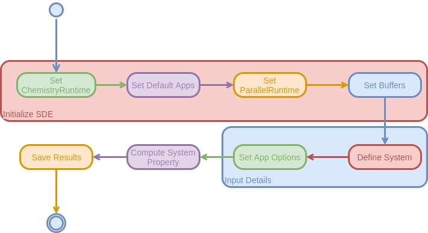
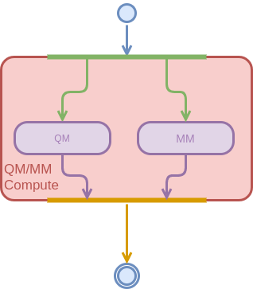

User Workflow
=============

The current page describes the flow of the SDE as seen by a typical user. It 
assumes familiarity with the topics covered in the [Overview](dox/overview.md) 
section.  The workflow itself is summarized by the following diagram and the
remainder of the page explains the diagram in more detail.




Initialize SDE
--------------

Generally speaking the first step in any calculation using the SDE is to 
initialize the various parts of the SDE.  It is anticipated that most runs will
do this via a convenience function akin to (possibly taking a few arguments):

```.cpp
auto sde = SDE::initialize();
```

This function will ensure that each component of the SDE is initialized to 
reasonable defaults.  Power users should feel free to manually instantiate 
one or more components of the SDE to suit their needs.


Define System
-------------

We view the description of the chemical system as the fundamental input to the 
program.  Exactly how one does this is described in more detail
on the page [Building a System](), but for now it suffices to say that this step
encompasses everything required to specify the total system (*i.e.* things like
what is QM or MM, *etc.* will be specified later).  The classes used to model
the system are provided and implemented by LibChemist.  For the simplest cases
it suffices to use one of the pre-built systems stored in the 
default `ChemistryRuntime` instance:

```.cpp
//Get the molecule stored in the default ChemicalRuntime instance as "water"
auto mol = sde.crt.pubchem["water"];
```

More generally utility functions (will) exist to turn various standard input 
forms into working systems, for example from a string xyz representation:

```.cpp
sstream water("0 1\n\nO 0.0 0.0 0.0\nH0.0 0.0 0.89\n0.0 0.89 0.0");
auto mol = parse_molecule_file(water, XYZParser(), sde.crt);
``` 

Compute System Property
-----------------------

This is the step where a desired property of the system is computed using the
current SDE.  The entry point to this step will almost always be a single app, 
but because apps are allowed to call each other, there's nothing stopping that app 
from calling a large number of additional apps.  As a superficial example 
here's how one would call two separate apps (one for the QM part and one for 
the MM part) to implement a QM/MM routine as a single app:



Syntactically this will look something like:
```.cpp
auto egy = sde.run("APP to run", mol);
```

Save Results
------------

After the property of interest is computed the results need to be archived.  
That happens here.  Ultimately, the SDE will have accumulated a lot of data
over the course of the run and this step focuses on archiving it so that it is 
accessible for analysis and possibly further calculations.  Presently 
archiving either as HDF5 or JSON is possible.

```.cpp
sde.archive("file/to/archive/to");
```

Putting this all together, the minimal input to run a meaningful calculation is:

```.cpp
auto sde = SDE::initialize();
auto egy = sde.run("app 2 run", sde.crt.pubchem["water"]);
sde.archive("file/to/archive/to");
``` 
